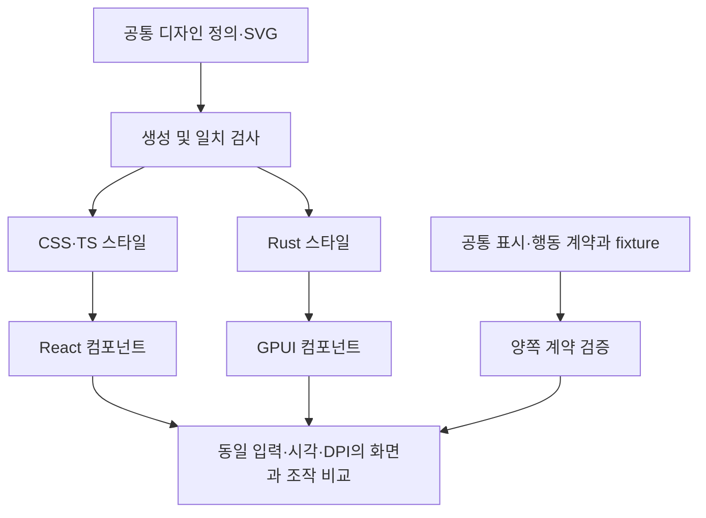

# Node·Rust 디자인과 기능·동작 표준화 검토

## 목적과 판단

두 배포 버전은 디자인뿐 아니라 표시 의미, 사용자 조작과 상태 전이도 동일해야 한다. 공통 색상과 크기를 사용한다는 사실만으로 동등성이 충족되지는 않는다. 기존 Node의 제품 경험을 기준으로 삼되, 확인된 결함은 기준으로 고정하지 않고 양쪽 계약을 바로잡는다. Codex 5h의 무지개·무한대 표시는 의도된 제품 규칙으로 유지한다.

GPUI는 재사용 가능한 Rust 컴포넌트와 스타일을 구성할 수 있다. 현재 사용하는 GPUI 0.2.2가 기존 CSS·React·TypeScript UI를 그대로 실행하는 것은 아니다. 언어와 독립적인 디자인 정의·상태 명세·검증 fixture를 공유하고, 각 렌더러의 구현을 그 계약에 맞추는 방향이 적합하다. 완전한 화면 일치는 아직 입증되지 않았으며 별도 검증이 필요하다.

이 문서는 가능성과 권장 경계를 기록한 검토다. 신규 UI 프레임워크 도입이나 구현 완료를 선언하지 않는다. 마일스톤 계획, 구현 체크리스트, 검증 결과는 이후 별도 문서로 관리한다.

## 현재 사실과 평가

| ID | 사실과 근거 | 평가 |
| --- | --- | --- |
| AA-001 | `src/renderer/styles.css`와 `src-native/ui/theme.rs`에 테마 값이 각각 정의되어 있다. Rust 화면에는 CSS에서 환산한 치수가 직접 지정되어 있다. | P1 주의·신뢰도 높음: 한쪽 수정이 다른 쪽에 자동 반영되지 않는다. |
| AA-002 | `src/renderer/icons.tsx`와 `assets/native-icons/`에 아이콘 표현이 분리되어 있다. native 헤더 글로우는 여러 SVG 실루엣으로 근사한다. | P1 주의·신뢰도 높음: 원본 공유와 효과의 시각적 동등성 검증이 모두 필요하다. |
| AA-003 | TS presentation과 Rust animated_text에 애니메이션 단계·색상·주기가 반복 정의되어 있다. selector와 native presentation에도 표시 규칙이 나뉘어 있다. | P1 주의·신뢰도 높음: 값의 공유뿐 아니라 입력별 기대 상태를 공통 검증해야 한다. |
| AA-004 | 설치된 GPUI의 `Render`, `RenderOnce`, `Styled`, `StyleRefinement`가 상태·컴포넌트·스타일 합성을 제공한다. `RenderOnce` 문서에는 재사용 컴포넌트 구성이 명시되어 있다. | 적합·신뢰도 높음: 화면마다 스타일과 상호작용을 반복 작성할 필요는 없다. |
| AA-005 | GPUI는 Rust 요소 트리와 스타일 API를 사용한다. 현재 앱에는 React/DOM/CSS 실행 연결 계층이 없다. | P1 주의·신뢰도 높음: Tailwind와 유사한 API를 웹 CSS 호환성으로 해석하지 않는다. |

근거 snapshot은 위 revision의 변경 없는 소스와 설치된 GPUI 0.2.2다. 정적 분석은 TS·Rust를 함께 조사했으며 일부 소스 해석 제한이 보고되어 대표 UI 소스를 직접 대조했다. 최신 upstream 자료는 가능성 조사에만 사용했고 현재 설치 버전의 기능으로 간주하지 않았다.

## 공통화할 계약과 기술별 책임

| 영역 | 공통 기준 | 기술별 구현과 검증 |
| --- | --- | --- |
| 디자인 | 테마, 벤더 색상, 글꼴 후보, 크기·행 높이·간격, 열 너비, 게이지 분할·라운딩, SVG 원본 | CSS와 Rust 스타일로 변환한다. 글꼴 선택·줄바꿈·DPI 차이는 실제 화면으로 확인한다. |
| 표시 의미 | quota 선택·순서·레이블, 미제공·stale·reset pending, 날짜·남은 시간·토큰 형식, 장애·오류 표현 | 같은 snapshot·고정 시각을 넣어 기대 표시 결과를 비교한다. 수집 원본은 UI에 전달하지 않는다. |
| 사용자 조작 | 갱신, 접기·펼치기, 추가 quota, 테마·고정, 도움말, 상태 링크, 드래그, 트레이 복귀·종료 | 이벤트 이름만 맞추지 않고 이전 상태·입력·다음 상태·외부 효과까지 비교한다. |
| 비동기 동작 | 캐시 우선 표시, 갱신 중 값 유지, 부분 반영, 중복 요청 병합, 오류·재시도, 종료 | 공통 시나리오와 가짜 시간·수집기로 순서와 결과를 검증한다. 디자인 계층이 수집 스케줄을 소유하지 않는다. |
| 모션 | 발동 조건, 단계·주기·색상 변화, hover·active·disabled, reduced motion | 효과의 명세를 공유한다. CSS keyframes와 GPUI 렌더링 코드는 별도로 구현하고 같은 시점에서 비교한다. |
| 플랫폼 | 클릭과 드래그 구역, 포커스, 키보드 조작, 링크와 창 생명주기의 사용자 결과 | OS별 연결 코드는 유지하되 사용자 결과가 달라지지 않는지 확인한다. |

공통 계약은 언어와 독립적인 데이터로 둔다. 디자인 값은 빌드 전 생성한 CSS/TS와 Rust 상수로 연결할 수 있다. 생성 결과를 저장소에 포함하고 재생성 일치 검사를 두면 배포 앱과 Rust 단독 빌드에 Node 실행 환경을 추가하지 않아도 된다. 앱 시작 시 디자인 파일을 읽는 방식은 필요하지 않다.

계산·분기 규칙까지 모두 JSON으로 표현하는 범용 UI 언어는 만들지 않는다. 단순 표는 공유하고, 복잡한 로직은 각 언어의 순수 함수와 공통 입출력 fixture로 일치시킨다. 동작 표준화가 모든 구현 코드를 한 언어로 합친다는 뜻은 아니다.

위 그림은 권장 구조이며 현재 구현 완료 상태를 나타내지 않는다. 공유 자산은 표시 계층에만 연결하고 인증·파일·네트워크 수집 경계를 우회하지 않는다.

## GPUI 연동 생태계와 선택 기준

- GPUI 공식 문서는 선언적 UI, Tailwind 스타일 API, 낮은 수준의 커스텀 요소를 설명한다. 재사용 구조는 제공하지만 브라우저 CSS 엔진은 아니다. 공식적으로 1.0 이전이며 버전 변경 시 호환성 위험이 있다. [공식 README](https://github.com/zed-industries/zed/blob/main/crates/gpui/README.md)
- Longbridge GPUI Kit은 동작 기반 계층, 스타일 컴포넌트, JavaScript 확장 계층을 구분한다. 현대적인 디자인 시스템·확장성을 고려한 상위 계층의 사례다. 현재 앱과의 버전 호환성·의존성 비용은 검증하지 않았으며 채택을 확정하지 않는다. [GPUI Kit](https://github.com/longbridge/gpui-kit)
- Zed의 embedded_gpui는 Wasm·JavaScript UI 확장 실험이며 별도 upstream 브랜치를 사용한다고 명시한다. 안정적인 CSS/React 호환 계층으로 취급하지 않는다. [실험 설계](https://github.com/zed-industries/embedded_gpui/blob/main/DESIGN.md)

권장안은 현재 GPUI에서 작은 재사용 컴포넌트를 구성하고 공통 계약으로 묶는 것이다. CSS 해석기, JS 런타임, React 변환기를 자체 구축하는 작업은 현재 요구를 충족하는 데 필요한 최소 변경이 아니다. 기존 React/CSS 구현 자체의 직접 공유가 필수 조건이 되면 렌더러 선택부터 별도 재검토해야 한다.

## 후속 검증과 완료 기준

먼저 게이지 한 줄과 벤더 아이콘으로 공통 정의·컴포넌트·fixture 연결을 검증한다. 밝음/어두움, 펼침/접힘, 정상/stale/미제공, 모션 단계·정지 상태를 비교한다. 이 결과로 GPUI의 글로우·그라데이션·폰트 차이를 해소할 수 있는지 판단한다.

그다음 화면 전체와 조작 시나리오로 확대한다. 같은 snapshot·시각·창 크기·DPI·폰트를 통제하고, 링크를 연 뒤 복귀, 반복 갱신, 툴팁과 드래그 충돌, 트레이 복귀, 종료를 포함한다. 시각 비교와 기능 검증은 서로 대체하지 않는다. 자동 검사를 통과해도 사용자 실화면 검수는 별도로 남기며 캡처는 Git 제외 경로에만 보관한다.

완료는 공통 정의 도입 여부가 아니라 양쪽의 사용자 결과로 판단한다. 불일치를 임의로 허용하지 않으며 발견된 차이·기술 제약·미검증 항목은 위험 기록에 명시한다. 현재는 검토 단계이므로 구현 마일스톤 완료 항목은 없다.
