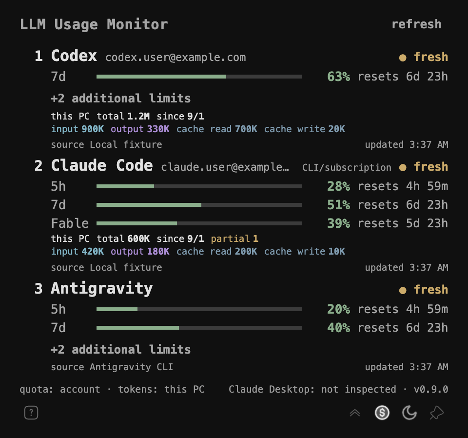
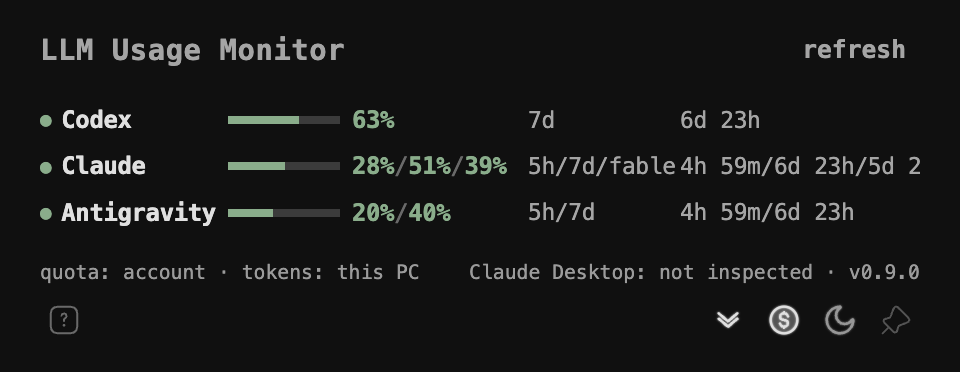

# LLM Usage Monitor (v0.9.5)

Codex, Claude Code, Antigravity(`agy`)의 5시간·주간 사용량 쿼터(Quota)와 이 PC의 로컬 토큰 사용량을 한눈에 보여주는 macOS·Windows 트레이 앱입니다.

<p align="center">
  
  <br>
  
  <br>
  <sub>상세 뷰(위)와 간이 모드(아래). 두 화면 모두 앱에 내장된 예시 데이터로 캡처했으며 계정·수치는 허구입니다.</sub>
</p>

---

## 요약

이 앱은 Codex, Claude Code, Antigravity CLI에 이미 로그인한 개발자가 계정 쿼터와 이 PC의 토큰 사용량을 작업 흐름을 끊지 않고 확인하도록 돕습니다. macOS와 Windows를 지원하며, 관리자 권한 없이 명령 하나로 빌드·설치·자동 시작 등록까지 끝납니다.

앱은 각 CLI가 가진 인증 소유권을 존중합니다. 토큰이나 자격증명 파일을 직접 읽거나 고치지 않고, 쿼터는 CLI가 보여주는 값만 사용합니다. 그래서 설치 뒤에 필요한 준비는 각 CLI에 로그인해 두는 것과, Claude Code에 한해 앱 전용 빈 폴더를 처음 한 번 신뢰(trust)해 주는 것뿐입니다.

아래 빠른 시작으로 설치하고, 프로바이더 초기 설정에서 카드가 모두 fresh 상태가 되면 준비가 끝납니다.

---

## 빠른 시작

### 1. 사전 준비

| 항목 | 요구 사항 |
| --- | --- |
| Node.js | 24.x |
| pnpm | 9.15 이상 10 미만 (`packageManager` 필드로 고정) |
| Codex | `codex` CLI 로그인 상태 |
| Claude Code | `claude` CLI 설치 및 로그인 상태 |
| Antigravity (선택) | `agy` 1.1.11 이상이 PATH에 있고 로그인 상태 |

macOS에서는 GUI 앱으로 실행돼도 `/opt/homebrew/bin`, `/usr/local/bin`, `~/.local/bin`, `~/.cargo/bin`을 PATH에 자동 병합하므로 별도 설정 없이 CLI를 찾습니다.

### 2. 설치

```bash
pnpm install

# 빌드 → 사용자 폴더에 설치 → 즉시 실행 (OS 자동 감지)
pnpm run deploy
```

| 명령 | 동작 |
| --- | --- |
| `pnpm run deploy` | 빌드 후 설치하고 실행 |
| `pnpm deploy:autostart` | 위와 같고, 로그인 시 자동 시작까지 등록 |
| `pnpm deploy:quick` | 기존 빌드 산출물을 재사용해 재설치 |
| `pnpm deploy:uninstall` | 설치본과 자동 시작 등록을 모두 제거 |

설치 위치는 macOS `~/Applications/LLM Usage Monitor.app`, Windows `%LOCALAPPDATA%\Programs\llm-usage-monitor`입니다. 관리자 권한(`sudo` / UAC)은 필요 없습니다. 플랫폼별 옵션은 [macOS 배포 가이드](docs/deploy-mac.md)와 [Windows 배포 가이드](docs/deploy-windows.md)를 참고하세요.

### 3. 열기

- macOS: 메뉴 막대의 아이콘을 클릭하면 팝오버가 열립니다. Dock에는 표시되지 않습니다.
- Windows: 작업 표시줄 트레이 아이콘을 좌클릭하면 열립니다.
- 두 OS 모두 아이콘 우클릭 메뉴에서 `열기`, `새로고침`, `기본 위치로 재설정`, `로그인 시 시작`(Windows: `Windows 로그인 시 시작`), `종료`를 사용할 수 있습니다.

---

## 프로바이더 초기 설정

각 카드 오른쪽 위의 상태 표시가 기준입니다.

| 상태 | 뜻 |
| --- | --- |
| `● fresh` | 최근 새로고침 성공. 설정 완료 |
| `● stale` | 새로고침 실패. 마지막 성공값을 유지하고 원인을 카드에 표시 |
| `● unavailable` | 아직 한 번도 성공하지 못함. 아래 절차 필요 |

### Claude Code: 최초 1회 폴더 신뢰 승인

Claude Code는 새 작업 폴더마다 신뢰 여부를 묻습니다. 앱은 쿼터를 읽기 위해 전용 빈 폴더에서 `claude`를 safe mode로 실행하므로, 이 폴더를 처음 한 번만 직접 승인해 주면 됩니다. 앱은 이 질문에 대신 답하거나 Claude 설정 파일을 고치지 않습니다.

| OS | 전용 폴더 |
| --- | --- |
| macOS | `~/Library/Application Support/LLM Usage Monitor/claude-probe` |
| Windows | `%LOCALAPPDATA%\LLM Usage Monitor\claude-probe` |

1. 앱을 열면 Claude Code 카드에 `● unavailable`, `Workspace trust confirmation required.` 문구와 `prepare folder` 버튼이 보입니다.
2. `prepare folder`를 클릭합니다. 터미널(macOS: Terminal.app, Windows: Windows Terminal)이 열리고 전용 폴더에서 `claude`가 자동 실행됩니다.
3. 터미널의 `Do you trust this folder?` 질문에 **Yes**를 선택합니다.
4. Claude 프롬프트에서 `/exit`를 입력해 종료합니다.
5. 앱에서 `refresh`를 누르거나 최대 60초 기다립니다. 카드가 `● fresh`로 바뀌고 5h·7d 게이지가 채워지면 완료입니다. 승인은 이후에도 유지됩니다.

로그인이 안 된 경우에는 카드에 `Sign in with the CLI to view quota.`와 `sign in` 버튼이 보입니다. 클릭하면 터미널에서 `claude auth login --claudeai`가 실행되며, 로그인 후 위 1단계부터 이어갑니다.

버튼을 눌러도 터미널이 열리지 않으면 다음을 확인하세요.

- Windows: Windows Terminal(`wt.exe`)이 설치되어 있어야 합니다.
- macOS: 처음 실행 시 "Terminal을 제어하도록 허용" 권한 요청이 뜨면 허용합니다. 거부했다면 시스템 설정 → 개인정보 보호 및 보안 → 자동화에서 LLM Usage Monitor에 Terminal 권한을 켭니다.
- 수동으로 진행하려면 터미널에서 전용 폴더로 이동한 뒤 아래 명령을 실행하고 3~5단계를 따릅니다.

```bash
claude --safe-mode --ax-screen-reader --restricted --strict-mcp-config --tools ""
```

앱이 자격증명을 다루는 범위는 [Anthropic 인증 경계 결정](docs/decisions/0001-anthropic-credential-boundary.md)에 정리되어 있습니다.

### Codex

`codex` CLI에 로그인되어 있으면 추가 설정 없이 동작합니다. 로그인이 풀리면 카드에 `Sign in with the CLI to view quota.`가 표시되니 터미널에서 `codex login`을 다시 실행하세요.

### Antigravity (선택)

`agy` 1.1.11 이상이 PATH에 있고 로그인되어 있으면 세 번째 카드가 나타납니다. CLI가 없으면 카드에 `CLI is not installed.`가 표시되며, 다른 프로바이더에는 영향을 주지 않습니다.

---

## 주요 기능

- **3대 AI 개발 도구 쿼터 통합 모니터링**
  - Codex: 7일 주간 한도 및 추가 모델 한도
  - Claude Code: 5시간 세션 한도, 7일 주간 한도, Fable 모델 한도
  - Antigravity: Gemini 모델군 5시간·주간 한도 및 Claude/GPT 추가 한도
- **듀얼 UI 모드**
  - 상세 뷰: 프로바이더별 계정, 진행 막대, 리셋 카운트다운, 로컬 토큰 2줄 보조 뷰
  - 간이 모드: 전 프로바이더의 주간/5h 쿼터를 한 줄씩 요약한 컴팩트 테이블 (`Ctrl/Cmd+Shift+C`)
- **핀 고정과 자유 배치**
  - 상단 헤더를 드래그해 화면 어디든 배치하고 마지막 위치를 기억
  - 핀 고정(`Ctrl/Cmd+Shift+P`) 시 다른 창에 가려지지 않으며, 재시작 후에도 핀 상태 유지
- **로컬 토큰 집계**
  - 계정 쿼터와 분리해 이 PC의 CLI 세션 로그(JSONL)를 청크 스트리밍과 체크포인트로 집계 (총 토큰, 입·출력, 캐시 읽기/쓰기)
- **TUI 스타일 인터랙션**
  - OS 다크/라이트 자동 동기화 및 수동 전환 (`Ctrl/Cmd+Shift+L`)
  - 새로고침 시 CLI 스타일 컬러 웨이브 쉬머
  - 0~9% 구간을 두 자리(`05%`)로 패딩해 게이지와 표의 자릿수 정렬 유지
  - 마우스가 창을 벗어나면 툴팁 즉시 닫힘
- **인증 경계 준수**
  - 벤더 CLI의 인증 소유권을 존중하며 토큰·자격증명 파일을 직접 읽거나 수정하지 않음

---

## 단축키 및 조작

단축키는 앱 창에 포커스가 있을 때 동작합니다. 하단 왼쪽의 <kbd>?</kbd> 버튼을 누르면 같은 내용을 앱 안에서 볼 수 있습니다.

| 기능 | Windows | macOS | 하단 버튼 |
| --- | --- | --- | --- |
| 간이 모드 전환 | <kbd>Ctrl</kbd>+<kbd>Shift</kbd>+<kbd>C</kbd> | <kbd>Cmd</kbd>+<kbd>Shift</kbd>+<kbd>C</kbd> | 위/아래 꺾쇠 (접기 ⌃ / 펼치기 ⌄) |
| 로컬 토큰 표시 전환 | <kbd>Ctrl</kbd>+<kbd>Shift</kbd>+<kbd>T</kbd> | <kbd>Cmd</kbd>+<kbd>Shift</kbd>+<kbd>T</kbd> | 코인 아이콘 (켜지면 채워짐) |
| 다크 / 라이트 테마 전환 | <kbd>Ctrl</kbd>+<kbd>Shift</kbd>+<kbd>L</kbd> | <kbd>Cmd</kbd>+<kbd>Shift</kbd>+<kbd>L</kbd> | 달(다크) / 해(라이트) 아이콘 |
| 항상 위(핀) 고정 | <kbd>Ctrl</kbd>+<kbd>Shift</kbd>+<kbd>P</kbd> | <kbd>Cmd</kbd>+<kbd>Shift</kbd>+<kbd>P</kbd> | 핀 아이콘 (고정되면 채워짐) |
| 팝오버 닫기 | <kbd>Esc</kbd> | <kbd>Esc</kbd> | 핀 해제 상태에서 창 외부 클릭 |

마우스 조작과 트레이 메뉴:

- 창 이동: 상단 헤더를 드래그합니다. 마지막 위치는 자동으로 기억됩니다.
- 상세 정보: 게이지·수치·버튼에 마우스를 올리거나 포커스하면 툴팁이 뜹니다.
- 트레이 아이콘 우클릭: `열기`, `새로고침`, `기본 위치로 재설정`, `로그인 시 시작`(Windows: `Windows 로그인 시 시작`), `종료`.

---

## 로컬 개발 및 테스트

```bash
pnpm install

# 현재 소스를 패키징하고 로컬 앱 실행 (설치는 하지 않음)
pnpm dev

# 선택: Vite HMR로 저장한 화면 코드를 즉시 반영
pnpm dev:hmr

# 실제 실행 파일의 시작·종료·프로필 격리 검사 (허구 데이터)
pnpm test:e2e:runtime

# 단위/통합 테스트
pnpm test

# 타입 체크 및 ESLint
pnpm typecheck
pnpm lint

# 프로덕션 패키징 (out/)
pnpm package

# 배포 산출물 생성: Windows는 Squirrel 인스톨러(.exe), macOS는 .zip
pnpm make

# README 스크린샷 재생성 (예시 데이터, pnpm package 선행 필요)
pnpm screenshot:readme
```

실제 CLI를 대상으로 한 읽기 전용 smoke 테스트는 `pnpm test:smoke:codex`, `pnpm test:smoke:claude-pty`, `pnpm test:smoke:local-usage`로 따로 실행합니다.

`pnpm dev`는 배포와 동일한 Forge 패키징을 사용하고, 생성된 Windows EXE 또는 macOS 앱 실행 파일을 직접 실행합니다. 코드 변경은 트레이의 종료 메뉴 또는 `Ctrl+C`로 종료한 뒤 다시 실행해 반영합니다. 창만 닫으면 트레이에 남습니다. 빌드에 실패하면 이전 앱을 대신 실행하지 않습니다.

두 개발 명령은 `appData/llm-usage-monitor-dev`에 설정·사용량 캐시·Chromium 데이터를 별도로 저장하므로 설치 앱과 함께 실행할 수 있습니다. 개발 명령끼리는 같은 프로필을 사용하므로 하나를 종료한 뒤 다른 명령을 실행하세요. 벤더 CLI의 기존 로그인은 그대로 사용하며 설치 폴더·바로가기·자동 시작 등록은 변경하지 않습니다.

GPU 종료와 흰 화면의 진단 절차 및 확인된 범위는 [트러블슈팅 가이드](TROUBLESHOOTING.md)를 참고하세요.

---

## 문서 및 참조

- [macOS 배포 도구 가이드](docs/deploy-mac.md)
- [Windows 배포 도구 가이드](docs/deploy-windows.md)
- [제품 컨셉 및 설계 원칙](docs/product-concept.md)
- [Anthropic 인증 경계 결정](docs/decisions/0001-anthropic-credential-boundary.md)
- Provider 계약: [Codex](docs/providers/codex.md) · [Claude Code](docs/providers/claude.md) · [Antigravity](docs/providers/antigravity.md)
- [아키텍처 증거 및 모듈 경계 분석](docs/architecture-evidence.md)
- [아키텍처 평가 및 분리 계획 보고서](docs/architecture-assessment.md)
- [v1 개발 로드맵](docs/plan/v1-roadmap.md)
