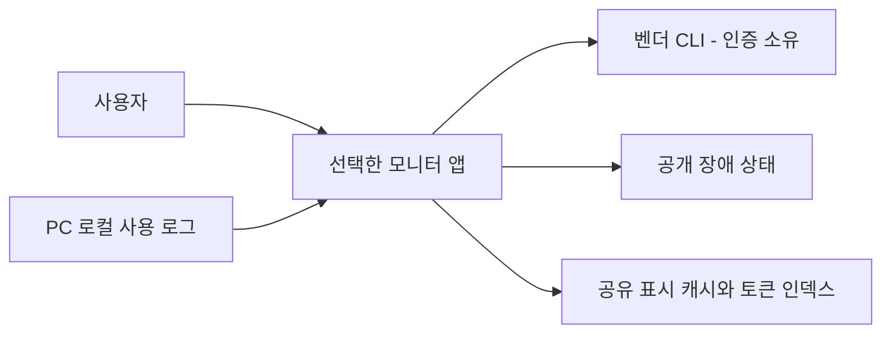
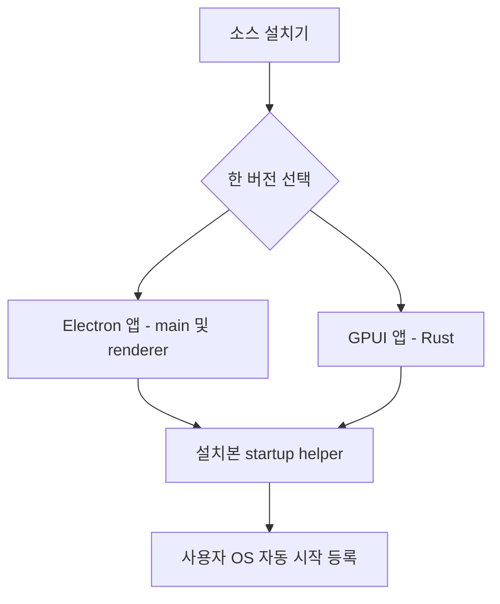
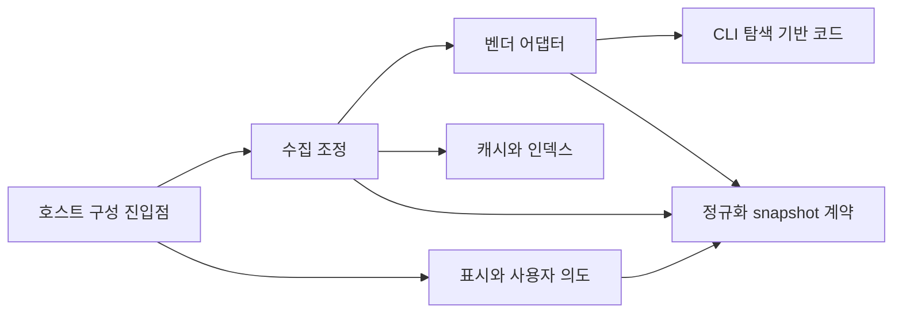
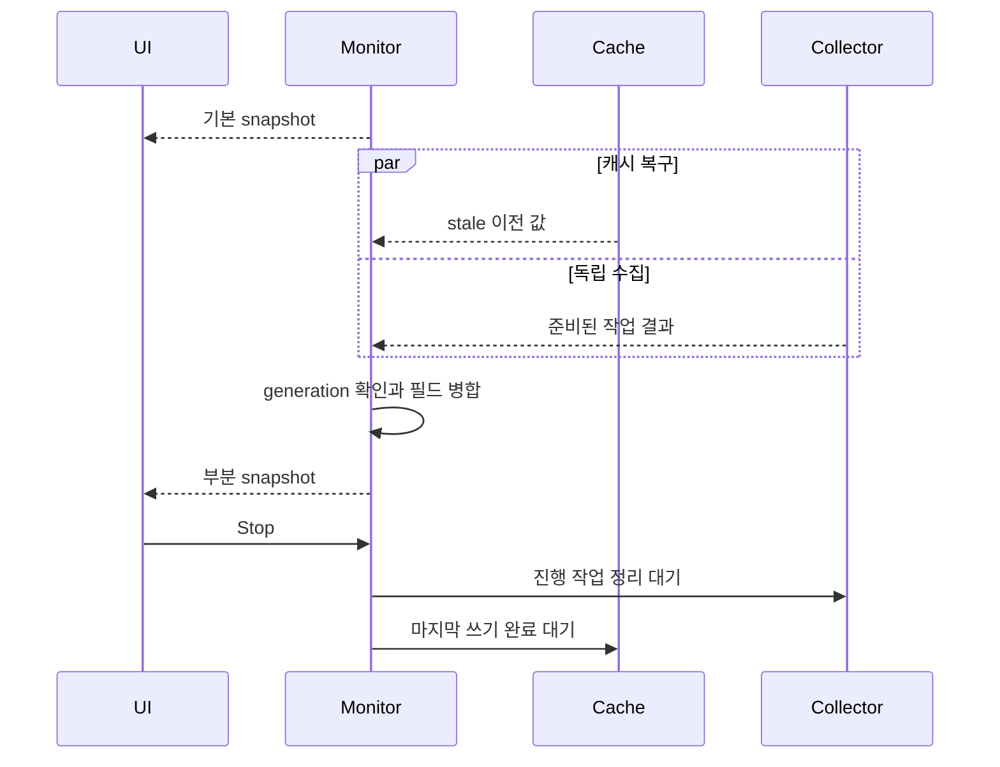

# LLM Usage Monitor 아키텍처 리뷰

이 문서는 현재 구현의 책임, 의존 방향, 검증 수준을 설명한다. 변경 과정과 과거 평가는 Git 이력에서 확인한다.

## 1. 제품 목표와 핵심 결론

제품 목표는 사용자가 Node/Electron 또는 Rust/GPUI 하나를 선택해 같은 quota·로컬 토큰 정보를 확인하는 것이다. 두 구현의 데이터 의미와 조작을 유지하면서, 벤더 수집 변경·설치 전환·UI 변경을 서로 독립적으로 검증하는 구조를 기준으로 평가한다. 주요 actor는 앱 사용자와 유지보수자이며, 우선 품질 목표는 **동작 일관성, 실패 격리, 변경 국소성**이다.

- **P2 주의:** CI 관문은 추가했지만 원격 실행 결과는 아직 없다. 공통 표시 fixture도 시간·백분율의 일부 규칙을 검증하며 모든 클릭 의도와 애니메이션을 보증하지 않는다.
- **강점:** Node core/provider는 main에 의존하지 않으며, Rust 저장·작업 식별·병합·스케줄링 책임은 별도 모듈에 있다. 추적 가능한 정책의 baseline은 0건이다.
- **강점:** Windows에서 설치 전환·실패 복구·양쪽 자동 시작 호출과 교차 캐시를 검증했다. Rust 자동 시작 헬퍼는 대기를 15초로 제한한다.
- **중요 미확인:** macOS 실기 설치·로그인·UI, Rust 전체 의미 기반 의존 분석은 남아 있다. 이 공백을 아키텍처 위반 0건이나 Windows 테스트 성공으로 대체하지 않는다.

## 2. 분석 기준과 증거 범위

| 항목 | 현재 기준 |
| --- | --- |
| 평가 상태 | 현재 구현 평가 초안(draft) |
| 분석 대상 코드 revision | `614ff3e4cd2b0e18c6c6e99397bc6f98b436e0f4` |
| 분석 시점 | 2026-09-20, clean 상태에서 분석; 이후 코드 변경 없음 |
| source digest | `b61b7e22769b276a7cdcc7ab338de4f0d3980780c3a93942e50853c8e60a82bd` |
| 소스 저장소 루트·분석 루트 | `C:/midas/codes/utils/llm-usage-monitor` (같은 경로, 다른 역할) |
| 프로젝트·manifest 루트 | 저장소 루트의 `package.json`, `Cargo.toml` |
| package root | TS는 `src` 모듈 트리, Rust crate는 `src-native/lib.rs` 및 Cargo의 bin 진입점 |
| 배포 단위 | Electron 앱(main/renderer/preload), 또는 Rust GPUI 앱; 설치기는 최종 앱 하나를 관리 |
| 증거 | [기계 분석 snapshot](architecture-evidence.md#evidence-snapshot) |
| 재현 명령 | `analyze-architecture.ps1 -Root <repo> -Output <temp>/architecture-facts.json -EvidenceOutput <repo>/docs/architecture-evidence.md` |

기계 증거와 평가는 위 코드 revision 및 source digest를 기준으로 한다. 테스트·빌드 결과의 실행 범위는 [검증 기록](../.work/ARCHITECTURE_IMPROVEMENT_CHECKLIST.md)에 명시되어 있다. 문서 편집 시 테스트를 재실행한 것으로 간주하지 않는다. 비동기 경로는 코드와 fixture 테스트에 근거하며 runtime trace가 아니다.

[Coverage](architecture-evidence.md#evidence-coverage)는 production 124개 모듈을 포함하고 test/fixture 등 48개를 제외한다. 원시 관계 관측 13,727건에서 imports/calls/registers 12,721건을 선별하고 내부 관계 확인·self-edge 제외·중복 제거를 거쳐 정규화된 module dependency 297개를 얻었다. 내부 재분류 관측은 0건이며 별도로 더하지 않는다. 이는 런타임 호출 횟수가 아니다.

[Diagnostics](architecture-evidence.md#evidence-diagnostics)의 `rust-src` 부재는 여전하다. [순환 후보](architecture-evidence.md#evidence-cycles) 3건을 확정 순환이나 제거해야 할 결함으로 보지 않는다. 기본 디렉터리 집계는 `src-native`를 하나로 묶으므로 아래 책임 경계는 코드·정책을 추가 대조한 결과다. guard의 171개 모듈·270개 확정 의존과 이 보고서의 production 집계는 범위·관계 정의가 달라 직접 비교하지 않는다.

## 3. 현재 아키텍처 판단

다음 판단은 분석 대상 소스와 Windows 검증에 근거한다. 식별자는 관련 문서에서 판단을 참조할 때 사용한다.

| Claim | 종류 | 상태 | 현재 판단 | 근거 |
| --- | --- | --- | --- | --- |
| AA-008 | 사실 | 확인 | 저장소 정책은 core/storage/infrastructure와 Rust 엔진을 포함하며 baseline은 비어 있다. lib.rs의 provider 모듈 선언은 구성 진입점 책임에 속한다. | `architecture/guard/policy.json`, `baseline.json`, `reports/current-check.md`; [경계 집계](architecture-evidence.md#evidence-boundaries) |
| AA-009 | 사실 | 확인 | 기본 unit 실행은 교차 캐시를 제외하지만 `contracts.yml`은 이를 별도 필수 step으로 실행한다. 원격 성공·브랜치 보호 설정은 미확인이다. | `.github/workflows/contracts.yml`, `vitest.config.mts`, `package.json` |
| AA-010 | 평가 | 적합 | core는 storage, provider는 infrastructure를 참조한다. Node의 실제 책임 소유와 의존 방향이 일치한다. | `src/core/UsageMonitorCore.ts`, `src/storage/index.ts`, `src/infrastructure/index.ts`; [경계 의존](architecture-evidence.md#evidence-boundary-dependencies) |
| AA-011 | 평가 | 적합 | cache/jobs/reducer/monitor를 분리하고 JobKey로 작업을 식별한다. 구체 provider 조립과 일괄 수집 API는 engine에 남는다. | `src-native/core/engine.rs`, `engine/*.rs`, 부분 갱신·Stop 테스트 |
| AA-012 | 평가 | 주의 | Windows 실제 설치 조정 함수와 양쪽 caller를 검증했다. Rust helper 실패·비정상 응답·timeout도 검증했다. OS 로그인·Mac 전환 전체는 미확인이다. | `scripts/test-install-entry.ps1`, `tests/unit/launchAtLogin.test.ts`, `src-native/shell/desktop.rs::startup_tests` |
| AA-014 | 사실 | 확인 | UI는 정규화된 snapshot과 사용자 동작 API 경계를 유지한다. | `src/preload/index.ts`, `src-native/ui` 및 [경계 의존](architecture-evidence.md#evidence-boundary-dependencies) |
| AA-015 | 사실 | 확인 | 부분 반영·실패 보존·교차 캐시·설치 복구 테스트가 Windows에서 통과했다. | [구현 검증 기록](../.work/ARCHITECTURE_IMPROVEMENT_CHECKLIST.md) |
| AA-016 | 제안 | 권장 | 별도 서비스/FFI 없이 언어 내부 경계와 공통 계약 검증을 강화하는 방향을 유지한다. 전체 UI 표준화 완료를 뜻하지 않는다. | [검사 안내](../architecture/README.md) |

## 4. 현재 책임과 데이터 흐름

관점: 사용자와 외부 시스템의 관계. Snapshot은 2장, 실선은 구현·계약에서 확인한 경로다. 벤더별 인증 세부 경로는 집계했다.

관점: 배포 단위와 설치 책임. Snapshot은 2장, 실선은 설치 구조이고 런타임 import 관계가 아니다. Node/Rust는 선택 대안이며 동시에 설치한다는 뜻이 아니다.

관점: 소스 책임과 허용 방향. Snapshot은 2장, 실선은 현재 내부 참조를 책임 단위로 집계했다. 두 언어 사이의 import는 없으며 Node와 Rust 세부 폴더 구성을 동일하게 강제하지 않는다.

관점: Rust 부분 갱신과 종료 순서. Snapshot은 2장, 실선은 코드·fixture 테스트로 확인한 개념적 순서이며 실행 시간 측정 trace가 아니다. 세부 8개 작업은 빠른/느린 수집으로 집계했다.

quota는 벤더 계정 범위이고 token은 PC 로그 집계다. 캐시는 마지막 표시·집계 값을 저장하며 인증을 소유하지 않는다. 창 위치·앱별 환경설정을 캐시 계약으로 변환하지 않는다. 외부 snapshot 계약과 Codex 5h의 의도된 무한대 표시는 별도의 표시 규칙으로 유지한다.

## 5. 평가 매트릭스와 변경 비용

등급은 🔴 부적합(목표 방해), 🟡 주의(위험 존재), 🟢 적합(현재 목표에 충분), ⚪ 미확인(근거 부족)이다. 신뢰도는 ●●● 높음(서로 다른 직접 증거), ●●○ 중간(직접·보조 증거), ●○○ 낮음(제한 표본)이다. P0~P3은 영향 우선순위이며 점수로 합산하지 않는다.

| 평가 축 | 우선순위 | 등급 | 신뢰도 | 핵심 근거 | 제품·변경 영향 |
| --- | --- | --- | --- | --- | --- |
| 공통 동작 검증 | P2 | 🟡 주의 | ●●● 높음 | AA-009·015, 공통 표시 fixture | CI 정의와 일부 표시 의미는 확보, 클릭·애니메이션 전체 계약은 남음 |
| 설치·운영 | P2 | 🟡 주의 | ●●● 높음 | AA-012 | Windows 복구·caller 검증 확대, 실제 OS 로그인 검수 필요 |
| Rust 의미 의존 | P2 | ⚪ 미확인 | ●○○ 낮음 | rust-src 부재 | 후보 순환을 근거로 추가 리팩터링하지 않음 |
| macOS 동등성 | P2 | ⚪ 미확인 | ●○○ 낮음 | 실기 실행 없음 | 설치 전환·자동 시작·UI 비교가 다음 단계 |
| Node 의존 방향 | — | 🟢 적합 | ●●● 높음 | AA-010와 경계 검사 | CLI 탐색 변경을 main 밖에서 검증 가능 |
| Rust 변경 국소성 | — | 🟢 적합 | ●●○ 중간 | AA-011와 회귀 테스트 | 저장·병합·스케줄 수정 위치를 구분 가능 |
| 추적 가능한 경계 정책 | — | 🟢 적합 | ●●● 높음 | AA-008 | 새 예외 없이 구조 검증 재현, TS CI 검사 가능 |
| 실패 격리·UI 경계 | — | 🟢 적합 | ●●● 높음 | AA-014·015 | 벤더 실패와 표시 변경의 영향 범위 제한 |

계층화는 앱 내부에 적용되며 Node 역방향 참조는 해소됐다. Ports and Adapters는 TS provider/IPC와 native UiEvents·OS helper 경계에서 **부분 적용**이다. 모든 구현체를 interface로 감싸거나 core의 구체 provider 생성을 제거해야 한다는 뜻은 아니다. 이벤트 기반 갱신은 단일 앱 coordinator 내부에서 **확인**되며 분산 이벤트 시스템은 아니다. 계약 중심 이중 구현은 cache·시간·백분율 fixture 범위에서 **부분 적용**이고 전체 시각 동등성은 미확인이다.

- CLI 탐색 변경은 `infrastructure/cli.ts`와 platform/provider 테스트에서 시작한다. 호스트 창·트레이 구현을 함께 바꿀 필요가 줄었다(AA-010).
- Rust 작업 추가는 JobKey·collector·스케줄과 해당 결과 테스트를 함께 검토한다. 저장이나 병합 규칙을 바꾸지 않는 변경은 각 모듈 내부로 제한한다(AA-011).
- 캐시 schema 변경은 두 언어와 교차 테스트를 한 작업으로 다룬다. 단위 테스트 통과만으로 호환성을 승인하지 않는다(AA-009·015).
- 자동 시작 변경은 helper와 caller 테스트에 OS 실기 검수를 더한다. 15초 timeout은 실패 통지이며 이미 변경된 등록의 원복 보장은 아니다(AA-012).

## 6. 검증 범위와 다음 확인

권장 구조는 언어별 수집·저장·표시·OS 책임을 나누고 공통 계약으로 동작을 검증하는 형태다(AA-016). 새 서비스나 FFI 도입을 정당화할 장애·배포 요구가 없어 별도 대안은 제시하지 않는다. 다음 작업은 구조 재작성보다 검증 공백을 줄이는 데 집중한다.

| 검증 대상 | 확인된 범위 | 남은 확인·중단 조건 |
| --- | --- | --- |
| 의존 경계 | Node main 역방향 참조 없음, tracked baseline 0건, TS 경계 검사 통과 | 새 예외 허용은 별도 검토; Rust 의미 그래프 전체 검증은 미완료 |
| 공통 데이터 계약 | Node 단위 테스트·교차 캐시 테스트, 독립 CI step 구성 | 원격 CI 실행·required check 설정은 미확인 |
| Rust 수집 엔진 | JobKey, 부분 갱신·stale·중복 refresh·Stop 회귀 테스트 | provider·스케줄 변경 시 해당 실패·종료 경로 재검증 |
| 설치·자동 시작 | Windows 전환·업데이트·실패 복구·제거, 한글/공백/BOM, 양쪽 caller, Rust timeout | Mac 실제 전환·OS 로그인은 미확인; 실제 인증·사용자 등록을 fixture로 쓰지 않음 |
| 표시·조작 | 시간대·pending·미제공·백분율 공통 fixture | 표시 선택·클릭 의도 전체와 시각 비교는 미완료 |

Rust 검증은 all-targets 35개 실행 후 timeout 테스트를 추가하고 startup 테스트 2개를 재실행한 기록이다(최종 테스트 정의 36개). Windows release 앱과 Electron 패키징은 성공했다. 기존 GPUI 전이 의존성의 future-incompat 경고는 남는다. 빌드 산출물·캡처는 Git에 추가하지 않는다.

원격 CI와 macOS 실기 검증 결과를 확보하면 해당 OS·revision과 함께 미확인 항목을 갱신한다. 새로운 구조 변경은 실제 회귀나 변경 비용의 근거가 있을 때 검토한다.
