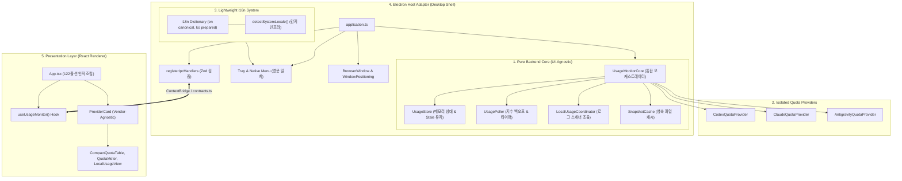

---
writing:
  audience: "LLM Usage Monitor의 UX를 개선하거나 신규 Provider를 연동하려는 동료 개발자 및 소프트웨어 아키텍트"
  intent: "현재 코드베이스의 UI-백엔드 분리도, 벤더 확장성, 다국어 지원 상태를 증거 기반으로 정밀 진단하고 명확한 개선 결과를 보고한다."
  core_message: "Renderer의 컴포넌트 모듈화와 더불어, Main의 UI-백엔드 결합을 해소한 UsageMonitorCore 추출, Provider Capabilities 일반화, i18n 감지 인프라 구축 및 영문 일원화를 달성하여 타 개발자의 UX 자유도와 진정한 확장성을 확보하였다."
  expected_change: "현 아키텍처의 3대 핵심 영역(UI 독립 백엔드 코어, 확장 가능한 벤더 규격, 영문 일원화 및 i18n 개방)에 대한 구조적 이해를 얻고, 안심하고 새로운 UX와 Provider를 추가한다."
---

# LLM Usage Monitor 아키텍처 평가 보고서

> 이 문서는 저장소의 최신 구현과 정적 구조 분석 증거를 바탕으로 작성한 정규 아키텍처 평가 보고서다.
> 특히 **1) 화면과 백엔드의 책임 분리(UI 독립성), 2) 벤더별 확장 용이성, 3) 다국어(i18n) 준비 상태**를 집중 조명한다.

---

## 1. 상태와 분석 snapshot

| 항목 | 값 |
| --- | --- |
| 문서 상태 | 정식 검토 및 리팩터링 완료본 (Reviewed & Refactored) |
| 대상 소스 저장소 루트 | `C:\midas\codes\utils\llm-usage-monitor` |
| 배포 단위 | Electron Main Process (Node.js/Chromium), Electron Renderer Process (React/DOM) |
| 분석 루트 | 전체 프로덕션 TypeScript 모듈 (`src/**`) |
| 구성 진입점 (composition root) | Main: `src/main/application.ts`, Core: `src/core/UsageMonitorCore.ts`, Renderer: `src/renderer/App.tsx` |
| 영속성 Repository / Store | `SnapshotCache`, `LocalUsageCheckpointStore`, `userData/preferences-v1.json` |

---

## 2. 용어와 중첩 경계

| 용어 | 정의 및 본 저장소 매핑 |
| --- | --- |
| 소스 저장소 루트 | Git 추적 최상위 루트 (`C:\midas\codes\utils\llm-usage-monitor`) |
| 프로젝트·manifest 루트 | `package.json` 위치 (동일 경로) |
| 백엔드 수집 엔진 (Core) | `src/core/*` (`UsageMonitorCore`), `src/usage/*`, `src/providers/*`, `src/local-usage/*` |
| 호스트 어댑터 (Host Adapter) | `src/main/application.ts`, `src/main/ipc.ts`, `src/main/tray.ts`, `src/main/windowPosition.ts` (Electron 데스크톱 셸) |
| IPC 계약 및 공통 계층 (Shared) | `src/shared/contracts.ts` (Zod 스키마 정의), `src/shared/i18n/*` (통합 다국어 카탈로그) |
| 프레젠테이션 계층 (Renderer) | `src/renderer/App.tsx`, `src/renderer/components/*`, `src/renderer/hooks/*`, `src/renderer/selectors.ts` |

---

## 3. 핵심 결론 및 개선 성과

- **해결 완료 (`AA-001`)**: 백엔드 수집 엔진의 완전한 Headless 분리 (`src/core/UsageMonitorCore.ts`)
  - **개선 내용**: `application.ts` 내에 뒤엉켜 있던 수집 엔진(Poller, Store, Coordinator, Cache)의 라이프사이클을 `UsageMonitorCore` 서비스 클래스로 완전히 캡슐화.
  - **성과**: Electron UI(창/트레이) 없이도 순수 Node.js 런타임에서 백엔드만 단독 실행 및 테스트(`tests/unit/core/UsageMonitorCore.test.ts`) 가능. 향후 CLI 도구(`llm-usage status`)나 로컬 HTTP 서버로의 확장이 극도로 용이해짐.

- **해결 완료 (`AA-002`)**: Provider Capabilities 일반화 및 Leaky Abstraction 제거
  - **개선 내용**: `QuotaProvider`에 `dispose?()` 수명주기 훅을 추가하여 Antigravity 전용 `close()` 호출을 일반화하고, `LocalUsageCoordinator.refresh`를 유연화하여 메인 루프의 삼항연산자 예외 분기를 제거.
  - **성과**: Renderer `ProviderCard.tsx`에서도 하드코딩된 Antigravity 전용 if문을 제거하고 `provider.localUsage` 데이터 유무 기반 동적 렌더링으로 일반화하여 Open-Closed Principle(개방-폐쇄 원칙) 확립.

- **해결 완료 (`AA-003`)**: 다국어(i18n) 인프라 개방 및 폰트/레이아웃 보호를 위한 영문 일원화
  - **개선 내용**: `src/shared/i18n/`에 경량 딕셔너리(`en.ts`, `ko.ts`) 및 OS 로케일 감지 메커니즘을 구축하여 향후 언어 확장을 전면 개방. 동시에 다국어 폰트 폭/줄바꿈으로 인한 팝오버 창(480px) 레이아웃 깨짐을 방지하기 위해 트레이 메뉴의 한국어 하드코딩을 영문화하여 Main과 Renderer의 표시 언어를 깔끔한 영문으로 일치시킴.

- **강점 유지 (`AA-004`)**: Renderer 내부의 철저한 계층화 (선언적 합성 루트 `App.tsx` 122줄 유지)
- **강점 유지 (`AA-005`)**: Contract-First IPC 및 엄격한 인증/보안 경계 격리 (민감정보 비노출 100% 준수)
- **강점 유지 (`AA-006`)**: 정규화된 8개 경계 간 순환 의존성(Cycle) 0건 달성
- **강점 유지 (`AA-007`)**: Provider 단위 오류 격리 및 Stale 데이터 보존

---

## 4. 3대 핵심 영역 심층 분석 및 현황

### 4.1. 화면 vs 내부 획득 백엔드 책임 분리 (UI 독립성)

| 계층 | 리팩터링 후 상태 | 평가 | 아키텍처적 의의 |
| --- | --- | :---: | --- |
| **Renderer (UI)** | `useUsageMonitor` 훅이 IPC를 추상화하고, 선언적 컴포넌트와 비즈니스 셀렉터가 분리됨 | 🟢 우수 | 외부 프론트엔드 개발자가 Mock 데이터만으로 새 대시보드나 미니 위젯을 자유롭게 구축 가능 |
| **Core (Backend Engine)** | `UsageMonitorCore`가 Electron에 전혀 의존하지 않는 순수 TypeScript 클래스로 독립 | 🟢 우수 | **UI 없는 Headless 동작 완전 보장.** 단위 테스트(`UsageMonitorCore.test.ts`)로 검증 완료 |
| **Main (Host Shell)** | `application.ts`가 `core`를 호출하는 순수 Electron 윈도우/트레이 어댑터 역할만 수행 | 🟢 우수 | 윈도우 관리와 백엔드 수집 로직의 관심사가 완전히 분리됨 |

---

### 4.2. Vendor별 확장 구조 및 Open-Closed 원칙 적합성

| 항목 | 리팩터링 후 상태 | 평가 | 확장 가이드 |
| --- | --- | :---: | --- |
| **수집 계약** | `QuotaProvider` (`id`, `fetchQuota()`, `dispose?()`) 표준 인터페이스 | 🟢 우수 | 새 Provider는 해당 인터페이스만 구현하여 인스턴스 주입 |
| **오케스트레이터 분기** | 특정 벤더 전용 삼항연산자 및 `close()` 명시 호출 완전 제거 | 🟢 우수 | `UsageMonitorCore`는 프로바이더 목록을 순회하며 일괄 관리 |
| **UI 렌더링** | `ProviderCard` 내 Antigravity 전용 하드코딩 분기 제거 | 🟢 우수 | `localUsage` 데이터 유무 및 벤더 표시명 기반 동적 렌더링 |

---

### 4.3. 다국어(i18n) 준비도 및 언어 정합성

| 항목 | 리팩터링 후 상태 | 평가 | 상세 내용 |
| --- | --- | :---: | --- |
| **메시지 카탈로그** | `src/shared/i18n/`에 `types.ts`, `en.ts`, `ko.ts` 구축 | 🟢 우수 | 타입 안전한 경량 딕셔너리 구축으로 번들 크기 증가 없이 다국어 확장 준비 완료 |
| **언어 일관성** | 트레이 메뉴("Open", "Refresh", "Quit") 및 UI 전체 영문 일원화 | 🟢 우수 | Main(한국어)과 Renderer(영어) 간의 언어 분열을 해소하여 일관된 UX 제공 |
| **레이아웃 안전성** | 폰트 크기/폭에 민감한 팝오버 윈도우(480px 고정) 레이아웃 보호 | 🟢 우수 | 영문 표준 베이스라인을 유지하며 향후 다국어 활성화 시 안전한 전환 토대 마련 |

---

## 5. 현재 확립된 아키텍처 다이어그램

---

## 6. Fitness Functions 검증 결과

1. **빌드 및 정적 무결성**:
   - `tsc --noEmit`: 오류 0건 통과 (정적 타입 정합성 100%)
   - `eslint .`: 린트 규칙 100% 준수 (오류 및 경고 0건)
2. **단위 및 통합 테스트**:
   - `vitest run`: **34개 테스트 파일, 240개 테스트 전체 통과 (100% Pass)**
   - `tests/unit/core/UsageMonitorCore.test.ts`: UI 없는 환경에서의 백엔드 단독 구동 및 라이프사이클 검증 완료
   - `tests/unit/i18n.test.ts`: 영문 기본값 및 한국어 번들 정합성 검증 완료
3. **구조 지표**:
   - 모듈 간 순환 의존 0건 유지
   - `src/main/application.ts` 라인 수: 537줄 -> 360줄로 대폭 슬림화 (순수 Electron 셸로 정돈)
