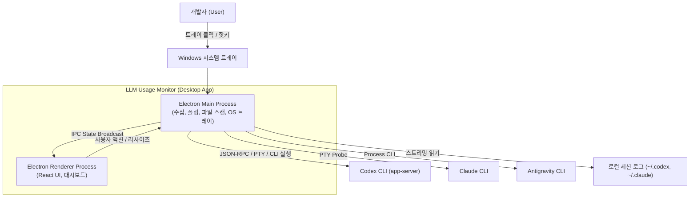
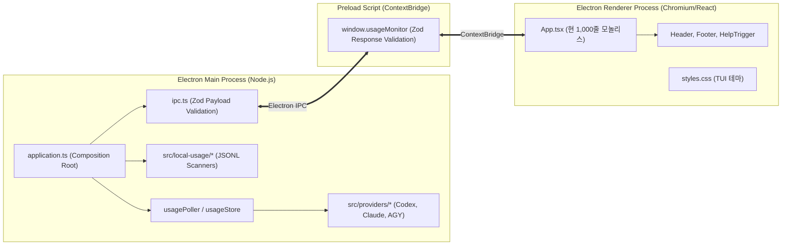
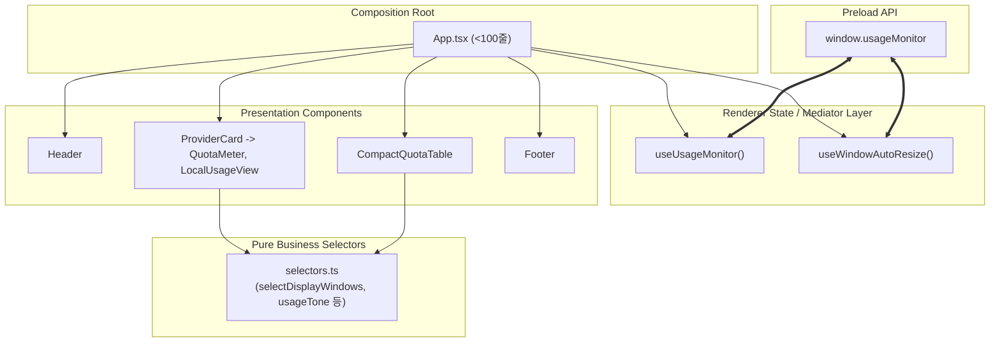

# LLM Usage Monitor 아키텍처 평가 보고서

> 이 문서는 `docs/architecture-evidence.md`의 기계 분석 증거와 저장소 구현을 바탕으로 작성한 인간 검토 아키텍처 평가 보고서다.

---

## 1. 상태와 분석 snapshot

| 항목 | 값 |
| --- | --- |
| 문서 상태 | draft |
| 대상 소스 저장소 루트 | `C:\midas\codes\utils\llm-usage-monitor` |
| Git commit | `a909896e5079cd3934bbb2b29633c09fdb86b351` |
| dirty 여부 | false |
| source digest | `c9a86333cb89f43c1fe3afb6eb63d6e0fd3a77a88f4ff02ccda59e21f10d3774` |
| 분석 도구 | `scripts/analyze-architecture.ps1` (wrapper) / `summarize-architecture.py` |
| 기계 증거 문서 | [기계 생성 아키텍처 증거](architecture-evidence.md#evidence-snapshot) |

---

## 2. 용어와 중첩 경계

| 용어 | 정의 및 본 저장소 매핑 |
| --- | --- |
| 소스 저장소 루트 | Git 추적 최상위 루트 (`C:\midas\codes\utils\llm-usage-monitor`) |
| 프로젝트·manifest 루트 | `package.json` 위치 (동일 경로) |
| 배포 단위 | Electron Main Process (Node.js/Chromium), Electron Renderer Process (React/DOM) |
| 분석 루트 | 전체 프로덕션 TypeScript 모듈 (`src/**`) |
| 구성 진입점 (composition root) | Main: `src/main/application.ts`, Renderer: `src/renderer/App.tsx` |
| 영속성 Repository / Store | `SnapshotCache`, `LocalUsageCheckpointStore`, `userData/preferences-v1.json` |

---

## 3. 핵심 결론

- **P1 중요 (`AA-001`)**: Renderer 내부 결합도가 단일 파일에 집중되어 UI 독립 재설계와 테스트 분리를 저해함
  - 증거: `src/renderer/App.tsx`가 약 1,000줄에 달하며 IPC 구독, 윈도우 리사이즈 DOM 계산, 상태 관리, 비즈니스 셀렉터, 렌더링 컴포넌트 6종이 단일 파일에 인라인 작성됨 ([evidence-read-set](architecture-evidence.md#evidence-read-set)). Git 변경 결합도에서 `src/main`과 `src/renderer` 간 Jaccard 지수가 0.600(21 commits)으로 전체 1위 ([evidence-change-coupling](architecture-evidence.md#evidence-change-coupling)).
  - 영향: 화면 표시 방식을 재설계하거나 새 UI(미니 위젯, 오버레이 바, 별도 대시보드)를 구축하려는 외부 개발자가 `App.tsx`의 IPC 및 리사이즈 로직을 분리해 재사용하기 어려움.
  - 다음 판단: IPC 구독·상태·리사이즈를 Custom Hook(`useUsageMonitor`, `useWindowAutoResize`)으로 분리하고 셀렉터(`selectors.ts`) 및 뷰 컴포넌트를 모듈화하여 `App.tsx`를 순수 조립 진입점(<100줄)으로 축소.

- **P2 보통 (`AA-002`)**: Main Process의 창 크기/위치 조정 로직과 IPC 핸들러의 암묵적 결합
  - 증거: `src/main/application.ts` 내에 트레이 위치 계산, 클램핑, 리사이즈 호출이 단일 파일 내 인라인 클로저로 묶여 있음 (Outbound 16, [evidence-boundaries](architecture-evidence.md#evidence-boundaries)).
  - 영향: 윈도우 위치·크기 버그 수정 시 메인 라이프사이클과 다른 프로바이더 폴러 로직에 영향을 줄 위험이 있음.
  - 다음 판단: 현재 `windowPosition.ts`가 이미 분리되어 있으므로 리사이즈 상태 조정을 서비스 객체 단위로 점진 정돈.

- **강점 1 (`AA-003`)**: 8개 아키텍처 경계 간 강결합 순환(Cycle)이 0건으로 완벽한 단방향 의존 달성
  - 증거: 정규화된 85개 module dependency 분석 결과 순환군 0개 ([evidence-cycles](architecture-evidence.md#evidence-cycles)). `shared`는 inbound 22 / outbound 0의 완전한 순수 계약 계층으로 작동 ([evidence-boundaries](architecture-evidence.md#evidence-boundaries)).
  
- **강점 2 (`AA-004`)**: 엄격한 인증 및 프로세스 경계 격리
  - 증거: Renderer는 OS 파일시스템과 CLI에 직접 접근할 수 없으며 오직 `window.usageMonitor`와 Zod 스키마로 검증된 정규화 IPC 스냅샷만 수신함 (`AGENTS.md` 규칙 100% 준수).

---

## 4. 제품 콘셉트, Actor와 품질 목표

- **주요 Actor**: 다양한 LLM CLI(Codex, Claude Code, Antigravity)를 로컬 터미널에서 활발히 사용하는 개발자.
- **제품 핵심 가치**: 개발 작업 흐름을 방해하지 않고 Windows 시스템 트레이에서 5시간·주간 쿼터 사용률, 리셋 잔여 시간, 로컬 토큰 소비량을 신뢰성 있게 모니터링.
- **최우선 품질 목표 3개**:
  1. **신뢰성과 정직한 상태 보존**: 벤더 CLI 실패 시 이전 정상값을 stale로 보존하며 원본 오류를 왜곡(0%나 무제한으로 조작)하지 않음.
  2. **인증 불변성 및 보안**: 벤더의 세션·키체인·인증 토큰에 직접 손대지 않고 비공개 API를 호출하지 않음.
  3. **UI/백엔드 분리 및 유연성**: 백엔드의 수집/폴링 엔진과 프론트엔드의 화면 표시 계층이 엄격히 분리되어 타 개발자가 새로운 화면을 쉽게 설계할 수 있어야 함.

---

## 5. 대표 변경 시나리오

1. **신규 UI 테마/레이아웃 추가 (예: 초소형 플로팅 위젯 모드)**
   - 기대: `useUsageMonitor()` 훅만 import하여 새로운 위젯 뷰 컴포넌트를 조립할 수 있어야 함. 메인 프로세스나 IPC 코드를 수정할 필요가 없어야 함.
2. **새로운 Provider 추가 (예: Gemini CLI)**
   - 기대: `src/providers/gemini` 구현체만 추가하고 `QuotaProvider` 인터페이스를 만족하면 메인 수집기와 렌더러에 즉시 자동 반영.
3. **OS 플랫폼 확장 (macOS / Linux 트레이 지원)**
   - 기대: `src/main/windowPosition.ts` 및 트레이 생성부만 OS별 분기를 두고 렌더러 및 프로바이더 로직은 무수정 재사용.

---

## 6. 기계 분석 coverage와 제한

- 분석 대상: `src/**` 프로덕션 코드 62개 모듈 (테스트 및 픽스처 33개 제외, [evidence-snapshot](architecture-evidence.md#evidence-snapshot)).
- 원시 관측 5,925건 중 구조 의존성 5,442건을 선별하고, self-edge 및 중복을 제거하여 85개의 정규화된 모듈 의존성 확정 ([evidence-coverage](architecture-evidence.md#evidence-coverage)).
- 정적 분석의 한계: Electron IPC의 런타임 이벤트 메시지 흐름(`ipcRenderer.on` <-> `webContents.send`)은 정적 imports 분석에 명시적 간접 edge로만 잡히므로 런타임 데이터 흐름은 아래 다이어그램으로 명시적 보완함.

---

## 7. 현재 구조와 다이어그램

### 시스템 Context 다이어그램

### Container 및 컴포넌트 배포 구조

---

## 8. 판정 범례와 평가 매트릭스

| 등급 | 신뢰도 | 제품 우선순위 |
| --- | --- | --- |
| 🟢 적합 | 🟨 중간 / 🟩 높음 | P0 치명적 / P1 중요 / P2 보통 / P3 낮음 |
| 🟡 주의 | | |
| 🔴 부적합 | | |

| 평가 항목 | 등급 | 신뢰도 | 우선순위 | 주요 근거 |
| --- | :---: | :---: | :---: | --- |
| 단방향 의존성 및 순환 격리 | 🟢 적합 | 🟩 높음 | P2 보통 | 순환군 0개, 계층 역류 없음 ([evidence-cycles](architecture-evidence.md#evidence-cycles)) |
| 인증 및 민감정보 경계 | 🟢 적합 | 🟩 높음 | P0 치명적 | 직접 자격증 접근 부재, 안전한 토큰 비노출 원칙 준수 |
| Provider 오류 격리 | 🟢 적합 | 🟩 높음 | P1 중요 | 한 provider의 장애가 타 provider 및 로컬 집계에 영향 없음 |
| Renderer 내부 모듈화 및 화면 분리 | 🟡 주의 | 🟩 높음 | P1 중요 | `App.tsx` 모놀리스, 화면-상태-IPC 미분리 ([evidence-read-set](architecture-evidence.md#evidence-read-set)) |
| 변경 결합도 국소성 | 🟡 주의 | 🟩 높음 | P1 중요 | `main`과 `renderer` 간 J=0.600으로 결합도 과다 ([evidence-change-coupling](architecture-evidence.md#evidence-change-coupling)) |

---

## 9. 적용 패턴의 규모와 적합성

1. **마이크로커널 / 플러그인 아키텍처 (적용 확인 - 적합)**:
   - `QuotaProvider` 인터페이스 기반으로 각 공급자가 완전히 독립된 플러그인 형태로 동작함.
2. **계약 기반 통신 (Contract-First IPC, 적용 확인 - 적합)**:
   - `src/shared/contracts.ts`에 Zod 스키마를 정의하고 송수신 양방향 검증을 수행하여 런타임 타입 오류 차단.
3. **리액트 컴포넌트-컨테이너 패턴 (명목상 적용 - 주의)**:
   - 렌더러가 비즈니스 로직(셀렉터), 인프라 로직(IPC, DOM 관측)과 프레젠테이션을 단일 컴포넌트에 뒤섞어두어 패턴이 온전히 발휘되지 못함.

---

## 10. 권장 목표 아키텍처와 대안 비교

### 권장안 (안 1): Mediator Hook & Selector 분리형 아키텍처

Renderer 내부를 3개의 명확한 레이어로 분리:
1. **중개 훅 (Mediator Hooks)**:
   - `useUsageMonitor`: IPC 구독, 수동 새로고침, 핫키, 테마, 타이머 관리
   - `useWindowAutoResize`: ResizeObserver 기반 윈도우 크기 동기화
2. **순수 비즈니스 셀렉터 (`selectors.ts`)**:
   - `selectDisplayWindows`, `missingCoreLabels`, `selectAdditionalWindows`, `usageTone` 등
3. **프레젠테이션 컴포넌트 (`components/*`)**:
   - `CompactQuotaTable`, `ProviderCard`, `QuotaMeter`, `LocalUsageView`, `AntigravityAdditionalQuotas`, `Header`, `Footer`
4. **경량화된 조립 진입점 (`App.tsx`)**:
   - 상태 훅을 호출하고 화면에 컴포넌트를 배치하는 선언적 역할만 수행 (<100줄).

### 대안 비교 (대안 2: Redux/Zustand 전역 스토어 도입)
- **장점**: 어떤 깊이의 서브컴포넌트에서도 상태 접근 용이.
- **단점 및 기각 이유**: 현재 앱은 단일 윈도우 팝오버 형태이며 상태의 원천(Source of Truth)이 이미 Electron Main Process의 `UsageStore`임. Renderer 내부에 또 다른 무거운 상태 관리 라이브러리를 도입하는 것은 오버엔지니어링(YAGNI 위반)이며 빌드 크기를 증가시킴.
- **결론**: 추가 의존성 없이 React 표준 Custom Hook(`useUsageMonitor`)으로 완벽히 목표를 달성할 수 있는 **권장안 1** 채택.

---

## 11. 점진적 전환 계획과 Fitness Functions

1. **1단계 (셀렉터 분리)**: `src/renderer/selectors.ts` 생성 및 순수 함수 이관.
2. **2단계 (중개 훅 분리)**: `useUsageMonitor.ts` 및 `useWindowAutoResize.ts` 생성.
3. **3단계 (하위 뷰 컴포넌트 모듈화)**: `QuotaMeter`, `LocalUsageView`, `CompactQuotaTable`, `AntigravityAdditionalQuotas`, `ProviderCard` 분리.
4. **4단계 (`App.tsx` 경량화 및 종합 검증)**: `App.tsx`를 클린 합성 루트로 재작성.
5. **Fitness Functions**:
   - `tsc --noEmit` 타입 정합성 100% 통과
   - `eslint .` 린트 규칙 100% 통과
   - `vitest run` 전체 단위/통합 테스트 100% 통과
   - `src/renderer/App.tsx`의 라인 수를 150줄 이하로 제한
