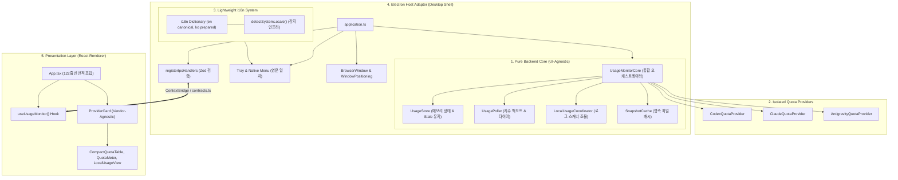
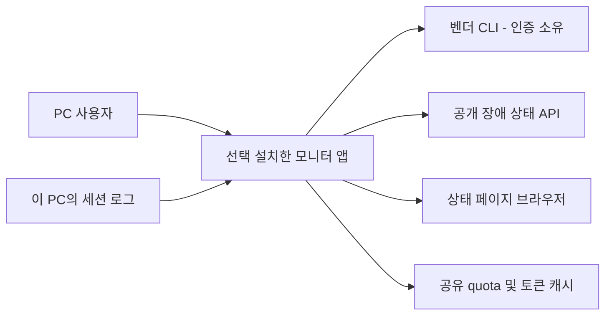
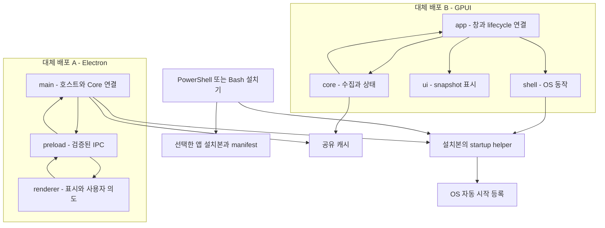
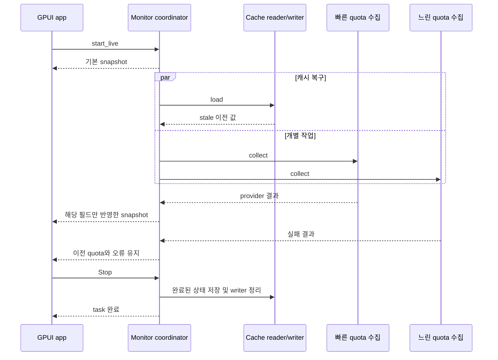
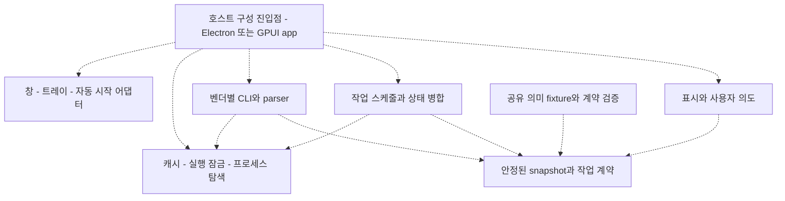

---
writing:
  audience: "LLM Usage Monitor의 UX를 개선하거나 신규 Provider를 연동하려는 동료 개발자 및 소프트웨어 아키텍트"
  intent: "현재 코드베이스의 UI-백엔드 분리도, 벤더 확장성, 다국어 지원 상태를 증거 기반으로 정밀 진단하고 명확한 개선 결과를 보고한다."
  core_message: "Renderer의 컴포넌트 모듈화와 더불어, Main의 UI-백엔드 결합을 해소한 UsageMonitorCore 추출, Provider Capabilities 일반화, i18n 감지 인프라 구축 및 영문 일원화를 달성하여 타 개발자의 UX 자유도와 진정한 확장성을 확보하였다."
  expected_change: "현 아키텍처의 3대 핵심 영역(UI 독립 백엔드 코어, 확장 가능한 벤더 규격, 영문 일원화 및 i18n 개방)에 대한 구조적 이해를 얻고, 안심하고 새로운 UX와 Provider를 추가한다."
---

# LLM Usage Monitor 아키텍처 평가 보고서

> **현재 구조 검토는 아래 [2026-09-20 재평가 초안](#assessment-20260920)을 기준으로 읽는다.** 기존 본문의 Reviewed 표기와 AA-001~AA-007은 당시 판단의 이력으로 보존한다. 기존 본문에는 현재 Rust·공유 캐시·설치 구조와 다른 내용이 있으며, 현재 revision에 대한 검토 완료 선언이 아니다.

> 이 문서는 저장소의 최신 구현과 정적 구조 분석 증거를 바탕으로 작성한 정규 아키텍처 평가 보고서다.
> 특히 **1) 화면과 백엔드의 책임 분리(UI 독립성), 2) 벤더별 확장 용이성, 3) 다국어(i18n) 준비 상태**를 집중 조명한다.

---

## 1. 상태와 분석 snapshot

| 항목 | 값 |
| --- | --- |
| 문서 상태 | 정식 검토 및 리팩터링 완료본 (Reviewed & Refactored) |
| 대상 소스 저장소 루트 | `C:\midas\codes\utils\llm-usage-monitor` |
| 배포 단위 | Electron Main Process (Node.js/Chromium), Electron Renderer Process (React/DOM) |
| 분석 루트 | 전체 프로덕션 TypeScript 모듈 (`src/**`) |
| 구성 진입점 (composition root) | Main: `src/main/application.ts`, Core: `src/core/UsageMonitorCore.ts`, Renderer: `src/renderer/App.tsx` |
| 영속성 Repository / Store | `SnapshotCache`, `LocalUsageCheckpointStore`, `userData/preferences-v1.json` |

---

## 2. 용어와 중첩 경계

| 용어 | 정의 및 본 저장소 매핑 |
| --- | --- |
| 소스 저장소 루트 | Git 추적 최상위 루트 (`C:\midas\codes\utils\llm-usage-monitor`) |
| 프로젝트·manifest 루트 | `package.json` 위치 (동일 경로) |
| 백엔드 수집 엔진 (Core) | `src/core/*` (`UsageMonitorCore`), `src/usage/*`, `src/providers/*`, `src/local-usage/*` |
| 호스트 어댑터 (Host Adapter) | `src/main/application.ts`, `src/main/ipc.ts`, `src/main/tray.ts`, `src/main/windowPosition.ts` (Electron 데스크톱 셸) |
| IPC 계약 및 공통 계층 (Shared) | `src/shared/contracts.ts` (Zod 스키마 정의), `src/shared/i18n/*` (통합 다국어 카탈로그) |
| 프레젠테이션 계층 (Renderer) | `src/renderer/App.tsx`, `src/renderer/components/*`, `src/renderer/hooks/*`, `src/renderer/selectors.ts` |

---

## 3. 핵심 결론 및 개선 성과

- **해결 완료 (`AA-001`)**: 백엔드 수집 엔진의 완전한 Headless 분리 (`src/core/UsageMonitorCore.ts`)
  - **개선 내용**: `application.ts` 내에 뒤엉켜 있던 수집 엔진(Poller, Store, Coordinator, Cache)의 라이프사이클을 `UsageMonitorCore` 서비스 클래스로 완전히 캡슐화.
  - **성과**: Electron UI(창/트레이) 없이도 순수 Node.js 런타임에서 백엔드만 단독 실행 및 테스트(`tests/unit/core/UsageMonitorCore.test.ts`) 가능. 향후 CLI 도구(`llm-usage status`)나 로컬 HTTP 서버로의 확장이 극도로 용이해짐.

- **해결 완료 (`AA-002`)**: Provider Capabilities 일반화 및 Leaky Abstraction 제거
  - **개선 내용**: `QuotaProvider`에 `dispose?()` 수명주기 훅을 추가하여 Antigravity 전용 `close()` 호출을 일반화하고, `LocalUsageCoordinator.refresh`를 유연화하여 메인 루프의 삼항연산자 예외 분기를 제거.
  - **성과**: Renderer `ProviderCard.tsx`에서도 하드코딩된 Antigravity 전용 if문을 제거하고 `provider.localUsage` 데이터 유무 기반 동적 렌더링으로 일반화하여 Open-Closed Principle(개방-폐쇄 원칙) 확립.

- **해결 완료 (`AA-003`)**: 다국어(i18n) 인프라 개방 및 폰트/레이아웃 보호를 위한 영문 일원화
  - **개선 내용**: `src/shared/i18n/`에 경량 딕셔너리(`en.ts`, `ko.ts`) 및 OS 로케일 감지 메커니즘을 구축하여 향후 언어 확장을 전면 개방. 동시에 다국어 폰트 폭/줄바꿈으로 인한 팝오버 창(480px) 레이아웃 깨짐을 방지하기 위해 트레이 메뉴의 한국어 하드코딩을 영문화하여 Main과 Renderer의 표시 언어를 깔끔한 영문으로 일치시킴.

- **강점 유지 (`AA-004`)**: Renderer 내부의 철저한 계층화 (선언적 합성 루트 `App.tsx` 122줄 유지)
- **강점 유지 (`AA-005`)**: Contract-First IPC 및 엄격한 인증/보안 경계 격리 (민감정보 비노출 100% 준수)
- **강점 유지 (`AA-006`)**: 정규화된 8개 경계 간 순환 의존성(Cycle) 0건 달성
- **강점 유지 (`AA-007`)**: Provider 단위 오류 격리 및 Stale 데이터 보존

---

## 4. 3대 핵심 영역 심층 분석 및 현황

### 4.1. 화면 vs 내부 획득 백엔드 책임 분리 (UI 독립성)

| 계층 | 리팩터링 후 상태 | 평가 | 아키텍처적 의의 |
| --- | --- | :---: | --- |
| **Renderer (UI)** | `useUsageMonitor` 훅이 IPC를 추상화하고, 선언적 컴포넌트와 비즈니스 셀렉터가 분리됨 | 🟢 우수 | 외부 프론트엔드 개발자가 Mock 데이터만으로 새 대시보드나 미니 위젯을 자유롭게 구축 가능 |
| **Core (Backend Engine)** | `UsageMonitorCore`가 Electron에 전혀 의존하지 않는 순수 TypeScript 클래스로 독립 | 🟢 우수 | **UI 없는 Headless 동작 완전 보장.** 단위 테스트(`UsageMonitorCore.test.ts`)로 검증 완료 |
| **Main (Host Shell)** | `application.ts`가 `core`를 호출하는 순수 Electron 윈도우/트레이 어댑터 역할만 수행 | 🟢 우수 | 윈도우 관리와 백엔드 수집 로직의 관심사가 완전히 분리됨 |

---

### 4.2. Vendor별 확장 구조 및 Open-Closed 원칙 적합성

| 항목 | 리팩터링 후 상태 | 평가 | 확장 가이드 |
| --- | --- | :---: | --- |
| **수집 계약** | `QuotaProvider` (`id`, `fetchQuota()`, `dispose?()`) 표준 인터페이스 | 🟢 우수 | 새 Provider는 해당 인터페이스만 구현하여 인스턴스 주입 |
| **오케스트레이터 분기** | 특정 벤더 전용 삼항연산자 및 `close()` 명시 호출 완전 제거 | 🟢 우수 | `UsageMonitorCore`는 프로바이더 목록을 순회하며 일괄 관리 |
| **UI 렌더링** | `ProviderCard` 내 Antigravity 전용 하드코딩 분기 제거 | 🟢 우수 | `localUsage` 데이터 유무 및 벤더 표시명 기반 동적 렌더링 |

---

### 4.3. 다국어(i18n) 준비도 및 언어 정합성

| 항목 | 리팩터링 후 상태 | 평가 | 상세 내용 |
| --- | --- | :---: | --- |
| **메시지 카탈로그** | `src/shared/i18n/`에 `types.ts`, `en.ts`, `ko.ts` 구축 | 🟢 우수 | 타입 안전한 경량 딕셔너리 구축으로 번들 크기 증가 없이 다국어 확장 준비 완료 |
| **언어 일관성** | 트레이 메뉴("Open", "Refresh", "Quit") 및 UI 전체 영문 일원화 | 🟢 우수 | Main(한국어)과 Renderer(영어) 간의 언어 분열을 해소하여 일관된 UX 제공 |
| **레이아웃 안전성** | 폰트 크기/폭에 민감한 팝오버 윈도우(480px 고정) 레이아웃 보호 | 🟢 우수 | 영문 표준 베이스라인을 유지하며 향후 다국어 활성화 시 안전한 전환 토대 마련 |

---

## 5. 현재 확립된 아키텍처 다이어그램

---

## 6. Fitness Functions 검증 결과

1. **빌드 및 정적 무결성**:
   - `tsc --noEmit`: 오류 0건 통과 (정적 타입 정합성 100%)
   - `eslint .`: 린트 규칙 100% 준수 (오류 및 경고 0건)
2. **단위 및 통합 테스트**:
   - `vitest run`: **34개 테스트 파일, 240개 테스트 전체 통과 (100% Pass)**
   - `tests/unit/core/UsageMonitorCore.test.ts`: UI 없는 환경에서의 백엔드 단독 구동 및 라이프사이클 검증 완료
   - `tests/unit/i18n.test.ts`: 영문 기본값 및 한국어 번들 정합성 검증 완료
3. **구조 지표**:
   - 모듈 간 순환 의존 0건 유지
   - `src/main/application.ts` 라인 수: 537줄 -> 360줄로 대폭 슬림화 (순수 Electron 셸로 정돈)

---

## 7. 2026-09-20 재평가 초안

**상태: draft.** 현재 판단은 아래 snapshot에 한정한다. 이번 작업은 리뷰와 문서 갱신이며 코드·정책·baseline은 수정하지 않았다.

### 7.1 제품 목표와 분석 snapshot

사용자는 한 PC에 Node/Electron 또는 Rust/GPUI 중 하나를 설치하고, 동일한 표시·조작으로 quota와 로컬 토큰을 확인한다. 버전을 바꿔도 마지막 데이터를 복구해야 하며 인증 소유권은 벤더 CLI에 남는다. 이 목표는 최근 사용자 요구와 현재 README/설치 코드에 근거한다. `docs/product-concept.md`의 Electron 중심 v1·Gemini 확장점·애니메이션 제외 설명은 역사적 초기 콘셉트이며 현재 구현의 정본으로 쓰지 않는다.

품질 목표는 세 가지다: **데이터·인증 경계 보존**, **두 구현의 동작 동등성**, **변경과 실패의 국소화**. actor는 PC 사용자, 벤더 CLI/상태 API, 설치·유지보수 담당자다.

| 항목 | 기준 |
| --- | --- |
| 소스 저장소 루트 | `C:/midas/codes/utils/llm-usage-monitor` |
| 프로젝트·manifest 루트 | 같은 디렉터리의 `package.json`, `Cargo.toml` |
| package root | TS는 `src` 아래 상대 import 모듈, Rust는 Cargo의 `src-native/lib.rs` 및 `src-native/bin/*` crate 진입점 |
| 배포 단위 | Electron 앱(main/preload/renderer), GPUI 네이티브 앱. 둘은 대체 설치 단위이며 동시에 필요한 서비스가 아님 |
| 분석 루트 | 소스 저장소 루트. 기계 분석은 지원 언어 모듈, 셸 설치 경로는 별도 수동 검토 |
| revision / 시작 상태 | `092f5a88d1e9a32449205e81d65b08b5293837d1` / clean |
| source digest | `e0c0f331b8b5c083e6c0edde0f47bcbbdd0000371d1fcddff4bd57023f8030c1` |
| 재현 | `sg-review-arch/scripts/analyze-architecture.ps1 -Root <repo> -Output <temp>/architecture-facts.json -EvidenceOutput docs/architecture-evidence.md` 및 `sg-guard-arch/scripts/architecture-guard.ps1 check --root <repo>` |
| 기계 증거 | [snapshot](architecture-evidence.md#evidence-snapshot), [coverage](architecture-evidence.md#evidence-coverage), [diagnostics](architecture-evidence.md#evidence-diagnostics) |

동일 물리 경로라도 Git 관리 범위, 빌드 기준, import namespace, 논리 책임을 구분한다. `src-native`라는 디렉터리 하나 안에도 types/core/providers/local-usage/ui/shell/app 책임이 있다. 기계 증거의 일차 디렉터리 집계는 이 책임들을 하나로 합치므로 그대로 설계 경계로 해석하지 않는다.

### 7.2 핵심 결론

- **P1 / AA-008: 경계 검사 통과가 현재 구조 전체를 보호한다는 뜻은 아니다.**
  - `src/core/**`가 정책 include 및 경계 정의에 없고, 현재 로컬 baseline은 15건이다. 대화에서 승인된 4건과 차이가 있으나 변경 경위는 Git에서 확인할 수 없다.
- **P1 / AA-009: 두 버전의 핵심 공유 계약 테스트가 CI 필수 관문에 연결되지 않았다.**
  - 공유 캐시 interop 테스트는 기본 `pnpm test`에서 제외되고 별도 명령에만 있다. 현재 두 workflow에도 해당 명령이 없다.
- **P2 / AA-010: Node의 논리적 수집 코어는 분리됐지만 물리적 의존 방향은 덜 정리됐다.**
  - core가 main의 캐시·fake 모듈을 사용하고, Codex/AGY provider가 main/platform을 참조한다. 그 platform은 Claude 내부 PTY 상수도 참조한다.
- **P2 / AA-011: Rust 엔진은 저장·잠금·생성·스케줄링·상태 병합 책임을 한 파일에 담고 있다.**
  - 작업 종류와 provider의 대응을 숫자 인덱스로 반복 계산한다. provider 추가나 갱신 규칙 변경이 여러 구간을 함께 건드린다.
- **P2 / AA-012: 설치·자동 시작의 공통화는 유효하지만, 변경 검증이 helper 중심이다.**
  - 실제 설치 진입점의 단계 순서·OS 호출·앱에서 helper를 부르는 경로를 하나로 검증하는 관문이 없다. 최근 사용자 실행에서만 드러난 오류들이 이 공백과 일치한다.
- **P2 / AA-013: 기존 평가 문서는 현재 분리 수준을 과도하게 확정한다.**
  - 완전한 headless 보장·Open-Closed 원칙 확립·보안 100%·전체 순환 0건을 현재 구조의 결론으로 재사용하면 안 된다.
- **강점 / AA-014: UI에 원본 수집을 맡기지 않는 경계와 snapshot 중심 갱신은 유지할 가치가 크다.**
- **강점 / AA-015: 공유 캐시 fixture와 수집 실패·부분 반영 테스트가 이미 있어 점진적 변경의 기반이 있다.**
- **중요 미확인:** Rust 의미 기반 순환 분석, macOS 설치·로그인 실기 동작, 전체 실화면 동등성은 이번 정적 리뷰로 확정하지 않는다.

### 7.3 Coverage와 판정 한계

기계 요약은 production 모듈 117개를 포함하고 test/fixture/example 46개를 제외했다. 원시 관계 관측 13,492건 중 imports/calls/registers 12,508건을 선별한 뒤 내부 모듈 판정·self-edge 제외·중복 제거를 거쳐 정규화된 module dependency 281개로 집계했다. 내부 재분류 관측은 0건이며 별도로 더하지 않는다. 이는 실행 횟수가 아니다. 상세 단위는 [기계 증거](architecture-evidence.md#evidence-coverage)에 둔다.

guard는 정책 선택 범위에서 모듈 161개, 확정 dependency 252개로 `pass`였다. 기계 요약과 대상 scope·관계 유형·해석 규칙이 달라 수치를 직접 비교하지 않는다. guard의 `pass`는 **현 정책과 baseline 대비 새 위반 없음**이다.

Rust는 `rust-src` 부재로 의미 해석이 축소됐다. 검출한 세 SCC는 모두 candidate이며 실제 실행 순환이나 확정 import 순환이라고 보고하지 않는다. 예를 들어 `providers/mod.rs`의 재노출과 자식 provider의 공통 command helper 사용, local-usage 부모 helper와 자식 parser 참조가 후보에 섞인다. [순환군](architecture-evidence.md#evidence-cycles)을 조사 신호로만 사용했다.

TS `UsageMonitorCore.refresh` trace는 depth 3 / nodes 24 제한으로 추출했지만 한 모듈·두 symbol까지만 연결됐다. interface dispatch 이후 poller/provider 동작은 원문으로 대조했다. Rust `start_monitor` trace는 rust-analyzer capability 부재로 실행 불가였다. 필요한 도구를 임의 설치하지 않았다. 정적 읽기는 런타임 E2E 검증을 대체하지 않는다.

`read_set` 28개가 제시한 main/core/provider/UI hub를 중심으로 보고, 계약·설치·CI·정책을 추가했다. 기존 테스트는 정의를 확인했으며 이번 문서 리뷰를 위해 앱·벤더 CLI·설치기·빌드 스크립트를 실행하지 않았다. 이전 턴의 테스트 통과는 이번 분석기의 결과와 구분한다.

### 7.4 현재 구조와 데이터 소유권

관점: 사용자가 어떤 외부 시스템과 연결되는가. snapshot은 7.1과 동일하며 실선은 코드로 확인한 연결이다. 벤더별 상세 프로토콜과 인증 내부는 생략한다.

관점: 실행·배포 단위와 파일 소유권. 실선은 확인한 데이터/제어 흐름이다. 두 앱 중 하나만 관리 설치되며 같은 공유 캐시의 동시 수집은 실행 잠금으로 배제한다. 설치 도구의 OS별 상세 동작은 생략한다.

TS의 `src/shared/contracts.ts`·preload 검증과 Rust의 `core/types.rs`는 수집 결과를 표시 입력으로 정규화한다. quota는 계정 범위, local usage는 기기 범위로 분리된다. 캐시는 인증정보 저장소가 아니며 표시 복구를 담당한다. 다만 두 언어의 타입·파서·표시 규칙은 각각 구현되어 있으므로 동일 이름만으로 의미 동등성을 보장하지 않는다.

관점: Rust에서 느린 수집을 기다리지 않는 경로와 실패 격리. 실선은 `start_monitor`, `apply_result`, `Job` 및 관련 테스트 정의에서 확인했다. 시점은 개념적 순서이며 측정 trace가 아니다.

### 7.5 사실·평가·제안 claim

| Claim | 종류 | 상태 | 주장 | 근거 | Revision/환경 |
| --- | --- | --- | --- | --- | --- |
| AA-008 | 사실 | 확인 | 현 guard 보호 범위에 core가 없고 baseline은 15건이다. 기존 승인 4건과 경위가 미확인이다. | 로컬 `.architecture-guard/policy.json` include/boundaries, `baseline.json`, current-check; `.git/info/exclude`로 상태 폴더 제외 | 092f5a8 / 이 PC의 로컬 정책 |
| AA-009 | 사실 | 확인 | shared-cache 테스트는 기본 테스트와 현재 CI에서 제외된다. | `vitest.config.mts:3`, `package.json`의 test:shared-cache, `.github/workflows/native.yml`, `install.yml` | 092f5a8 |
| AA-010 | 평가 | 주의 | UI-independent core의 파일 소유권과 의존 방향이 미완성이다. Electron import 부재만으로 완전 분리라고 하지 않는다. | `src/core/UsageMonitorCore.ts:27`, `src/providers/codex/appServerClient.ts:14`, `src/providers/antigravity/processRunner.ts:8`, `src/main/platform/index.ts:4`; [경계 의존](architecture-evidence.md#evidence-boundary-dependencies) | 092f5a8 |
| AA-011 | 평가 | 주의 | Rust 엔진 내 책임 응집과 작업 식별 방식이 변경 국소성을 낮춘다. | `src-native/core/engine.rs`의 cache(10), UsageMonitorEngine(149), MonitorEvent(362), apply_result(407), collect/start_monitor(536); [hub와 후보 순환](architecture-evidence.md#evidence-module-hubs) | 092f5a8 |
| AA-012 | 평가 | 주의 | 공통 startup helper는 중복을 줄였지만 배포 어댑터 통합 검증이 부족하다. | `scripts/install.ps1:71`, `:99`, `scripts/test-install.ps1`의 함수 대체; `src/main/launchAtLogin.ts`, `src-native/shell/desktop.rs:288`; 설치 workflow의 macOS syntax/check 단계 | 092f5a8 / 실기 macOS 미확인 |
| AA-013 | 평가 | 주의 | 기존 Reviewed 보고서는 현재 배포·경계와 drift가 있어 역사적 판단으로 보존해야 한다. | 기존 AA-001~007과 현재 [snapshot](architecture-evidence.md#evidence-snapshot), [경계](architecture-evidence.md#evidence-boundaries) 대조 | 이전 revision 미표기 / 현재 092f5a8 |
| AA-014 | 사실 | 확인 | UI는 정규화된 snapshot과 사용자 동작 API를 중심으로 작동한다. | `src/preload/index.ts:25`, `src/renderer/hooks/useUsageMonitor.ts:11`, `src-native/ui/quota_card.rs:6`, native `UiEvents`; [renderer dependency](architecture-evidence.md#evidence-boundary-dependencies) | 092f5a8 / 읽은 대표 경로 |
| AA-015 | 사실 | 확인 | 실패 보존·부분 반영·교차 캐시용 fixture와 테스트 코드가 존재한다. | `tests/unit/sharedCacheInterop.test.ts`, native engine monitor_tests, `src/usage/store.ts` | 092f5a8 / 존재·경로 확인, 이번 실행 아님 |
| AA-016 | 제안 | 권장 | 하나의 앱 프로세스를 유지하고 각 언어 내부 책임을 재배치하며 공유 동작 fixture를 릴리스 관문으로 삼는다. | AA-008~015, 7.8 목표와 7.9 전환표 | 인간 검토 대기 |

AA-008의 15건은 15개 독립 사고가 아니다. 같은 참조가 forbidden-dependency와 private-api-bypass로 각각 집계되기도 한다. 테스트 내부 참조와 production 역방향 참조를 나누어 검토해야 한다. 이번 작업에서 정책을 완화하거나 15건을 승인된 것으로 재해석하지 않았다.

### 7.6 평가 매트릭스와 패턴

등급: 🔴 부적합은 목표를 직접 방해, 🟡 주의는 현재 동작하나 변화 비용/위험 존재, 🟢 적합은 현재 목표에 충분, ⚪ 미확인은 근거 부족이다. 신뢰도: ●●● 높음은 두 종류 이상 직접 증거, ●●○ 중간은 직접 증거와 보조 근거, ●○○ 낮음은 제한 표본/추론이다. P0~P3은 영향 우선순위이며 등급·신뢰도와 독립이다. 총점은 없다.

| 평가 축 | 우선순위 | 등급 | 신뢰도 | 핵심 근거 | 제품·변경 영향 |
| --- | --- | --- | --- | --- | --- |
| 드리프트 방지 | P1 | 🔴 부적합 | ●●● 높음 | AA-008: core 제외, 로컬 baseline, CI guard 없음 | 코어 변경이 구조 검사를 우회할 수 있음 |
| 두 구현의 계약 검증 | P1 | 🟡 주의 | ●●● 높음 | AA-009·015 | 캐시·동작 변경이 한쪽만 통과할 위험 |
| 의존 방향·책임 소유 | P2 | 🟡 주의 | ●●● 높음 | AA-010 | CLI 실행 변경에 main/provider 여러 경계가 필요 |
| Rust 변경 국소성 | P2 | 🟡 주의 | ●●○ 중간 | AA-011 | provider 추가가 배열·인덱스·병합·스케줄 동시 변경을 요구 |
| 설치·운영 어댑터 | P2 | 🟡 주의 | ●●● 높음 | AA-012와 사용자 설치 실패 기록 | 테스트가 실제 OS 호출의 차이를 놓침 |
| 아키텍처 문서 신뢰성 | P2 | 🟡 주의 | ●●● 높음 | AA-013 | 신규 작업자가 과도한 보장을 전제로 수정할 위험 |
| UI·수집 분리 | — | 🟢 적합 | ●●● 높음 | AA-014 | UI 변경 시 인증·원본 수집을 읽을 필요가 줄어듦 |
| 실패 격리·상태 보존 | — | 🟢 적합 | ●●● 높음 | AA-015 및 store/monitor 구현 | 벤더 하나의 실패를 해당 결과에 국한 |
| macOS 운영 동등성 | P2 | ⚪ 미확인 | ●○○ 낮음 | 셸/CI 정의만 확인 | 로그인·전환·UI 실기 검수 필요 |

| 패턴·아키텍처 | 일반적 적용 규모·단위 | 잘 맞는 상황 | 현재 관찰 범위 | 판정 | 핵심 근거 |
| --- | --- | --- | --- | --- | --- |
| 계층화된 데스크톱 앱 | 애플리케이션·컴포넌트 | 로컬 수집과 UI 분리 | 양쪽 UI→정규화 계약, 호스트가 OS 연결 | 부분 적용 | Node lower layer→main 참조 존재 |
| Ports and Adapters | 경계·통합 | 외부 CLI/OS를 대체 검증 | TS QuotaProvider, IPC, native UiEvents | 부분 적용 | Rust concrete provider 생성과 수집 key가 엔진에 고정 |
| 이벤트 기반 상태 갱신 | 애플리케이션 내부 | 서로 다른 수집 완료 시간 | TS subscribe/store, Rust MonitorEvent와 coordinator | 확인 | 부분 반영·generation·병합 경로. 분산 이벤트 시스템을 의미하지 않음 |
| 구성 진입점 | 애플리케이션·컴포넌트 | 호스트와 구현체 조립 | application.ts / native main.rs / core create | 부분 적용 | core 생성·setup marker·cache 위치 결정까지 한곳에 있음 |
| 계약 중심 이중 구현 | 경계·통합 | 런타임 교체와 캐시 재사용 | JSON snapshot·공유 캐시·fixture | 부분 적용 | 교차 검증이 CI 필수가 아니며 UI 의미는 별도 구현 |

### 7.7 유지보수·에이전틱 코딩 평가

- 🟡 벤더 CLI 탐색 변경 — 파일 위치상 main 어댑터와 provider 책임을 함께 읽어야 한다.
  - 연결 평가: AA-010, 계층화·adapter 부분 적용. 사람이 resolver/terminal/PTy 상수를 구분해야 하고 Agent도 main 전체를 안전하게 공통 모듈로 오인할 수 없다.
  - 최소 검증: resolver/platform 테스트와 provider 대표 실패 테스트. 실제 인증 세션은 테스트 입력으로 쓰지 않는다.
- 🟡 Rust provider/작업 추가 — 한 숫자가 provider·종류·배열 위치의 세 역할을 가진다.
  - 연결 평가: AA-011, 이벤트 기반 coordinator는 유지하되 작업 식별을 타입으로 표현할 필요가 있다. Agent의 수정 범위는 collect/apply_result/schedule/refreshing의 네 구간 이상이다.
  - 최소 검증: 느린 작업·실패·중복 refresh·Stop fixture를 먼저 고정한다.
- 🔴 공유 캐시 schema 변경 — 양쪽 코드와 fixture를 읽어도 기본 테스트만 실행하면 교차 호환을 놓칠 수 있다.
  - 연결 평가: AA-009, 계약 중심 이중 구현 부분 적용. 유지보수자와 Agent 모두 명시적인 교차 테스트 관문이 필요하다.
  - 최소 검증: test:shared-cache와 지원 OS별 quota/token 복구 시나리오.
- 🟡 자동 시작 변경 — helper는 하나지만 TS/Rust caller·두 OS 설치기까지 호출 계약이 퍼져 있다.
  - 연결 평가: AA-012, adapter 통합 검증 부족. 인수·encoding·오류·timeout을 함께 검토해야 한다.
  - 최소 검증: 임시 설치본과 격리 OS 상태로 설치 진입점 및 앱 caller까지 테스트한다.
- 🟢 UI 정보 추가 — snapshot과 표시 selector를 시작점으로 삼을 수 있다.
  - 연결 평가: AA-014, UI 계약 경계 유지. 수집 범위를 바꾸지 않는 변경은 renderer/native-ui에 국소화할 수 있다.
  - 최소 검증: 공통 snapshot에 대한 의미 비교와 수동 실화면 검수. 실화면 캡처는 Git 제외 경로에 둔다.

### 7.8 권장 목표 아키텍처

**AA-016: 두 앱과 현재 실행 모델을 유지하면서, core·infrastructure·host 책임을 명시적으로 나누는 한 가지 안을 권장한다.** 서비스 분리, 별도 백엔드 프로세스, CSS와 GPUI를 억지로 공유하는 프레임워크는 현재 요구에 필요하지 않다. 다른 배포 제약이 없으므로 두 번째 대안을 만들지 않는다.

관점: 허용할 소스 의존 방향. 점선은 제안이며 현재 구현이라고 주장하지 않는다. snapshot은 7.1, 근거는 AA-008~016이다. 아래 구조를 TS와 Rust 각각 적용하고 두 언어 간 직접 import는 만들지 않는다.

core는 스케줄·상태 의미, infrastructure는 파일·프로세스·잠금, host는 구체 구현 조립과 OS lifecycle을 소유한다. infrastructure가 UI나 특정 provider 내부를 참조하지 않게 한다. 모든 곳에 interface를 추가하지 않고 실제 교체·테스트 필요가 있는 수집/저장/OS 경계에만 주입점을 둔다.

첫 전환은 TS CLI resolver와 터미널 실행 분리다. 다음으로 cache/fake의 소유 위치를 바로잡는다. Rust는 engine의 공개 start/Stop/snapshot 계약을 유지한 채 cache·scheduler·reducer를 나눈다. 비용은 import 이동과 테스트 위치 조정이며, 한 번에 타입·UI·저장 schema를 바꾸면 동작 회귀를 구분하기 어려우므로 피한다.

### 7.9 점진적 전환과 fitness functions

| 단계 | 변경할 경계 | 보존할 동작 | 선행 조건 | 검증·fitness function | 중단 조건 |
| --- | --- | --- | --- | --- | --- |
| A1 경계 계약 복구 | 정책·검증 배포 | 기존 baseline을 자동 확대하지 않음 | 현재 15건과 승인 4건 차이의 인간 검토, rust-src capability 확보 여부 결정 | core를 포함한 production source coverage 누락 0, 정책/검사 명령을 팀·CI에서 재현 가능하게 관리 | 새 위반을 baseline 추가만으로 통과시키려 할 때 |
| A2 계약 관문 연결 | CI·공유 fixture | 양쪽 캐시·quota 의미 | Node24/pnpm과 Rust를 제공하는 격리 runner | Windows/macOS test:shared-cache, 기존 unit 테스트 필수; cache/types/parser 변경이 workflow trigger에 포함 | 교차 결과 불일치 또는 개인정보 fixture 혼입 |
| A3 Node 책임 이동 | main/platform·core·storage | CLI 실행·숨김·인증 소유권·캐시 파일 형식 | A1에서 목표 방향 명시 | provider→main 0, core→main 0, resolver/host/provider 테스트와 headless core 테스트 | CLI 실행 인수나 snapshot이 의도치 않게 바뀜 |
| A4 Rust 엔진 분리 | engine cache/job/reducer | partial update, stale, backoff, Stop flush | 기존 monitor fixture 확보 | 숫자 key 대신 종류+provider 작업 식별, 느린 provider 이전 빠른 결과 도착, 작업별 single-flight | 종료/부분 반영 순서 또는 캐시 의미 변경 |
| A5 설치 수직 검증 | installer·startup caller | 한 설치본, 원복, 기존 도구 보존 | 격리 registry/임시 사용자 환경·artifact 주입 지점 | Node→Rust→Node 전체 진입점, helper 오류/timeout/잠김/encoding, 실패 후 이전 설치 유지 | 실사용 레지스트리·인증·앱 강제 종료가 테스트에 필요해짐 |
| A6 동작 기준 확장 | 두 UI의 의미 fixture | Codex 의도된 무한대·기존 디자인·영어 | 기존 parity 문서와 사용자 수동 기준 | 표시 선택·reset 시간·클릭 의도에 동일 fixture 적용, 캡처 수동 비교 | 기술 통합 때문에 제품 동작을 바꾸려 함 |

각 단계는 별도 리뷰 가능한 변경으로 수행하며 실패 시 해당 단계의 코드만 되돌린다. 공통 cache schema와 설치 CLI는 호환 변경만 허용한다. 이 표는 제안이며 이번 리뷰에서 리팩터링을 실행한 것은 아니다.

### 7.10 남은 확인과 재검토 조건

- 로컬 baseline 15건의 발생 시점·승인 경위는 미확인이다. tracked 이력이 없어 사용자 확인이나 별도 과거 기록 대조가 필요하다.
- Rust candidate cycle은 sysroot·rust-analyzer를 갖춘 환경에서 다시 분석해야 한다. 현재 후보를 제거 목표로 세우지 않는다.
- OS 자동 시작과 installer rollback의 실제 운영 안전성은 읽기만으로 보장하지 않는다. macOS 로그인·재부팅, Windows 깨끗한 PC 설치는 기존 수동 체크리스트를 따른다.
- 기존 공유 캐시 테스트는 좋은 출발점이지만 디자인·애니메이션·사용자 동작 전부를 규정하지 않는다. UI 변경이 잦아지면 A6을 앞당긴다.
- runtime 격리·프로세스 분리나 양쪽 언어를 잇는 FFI는 성능·장애 증거가 실제로 요구할 때 별도 평가한다.
