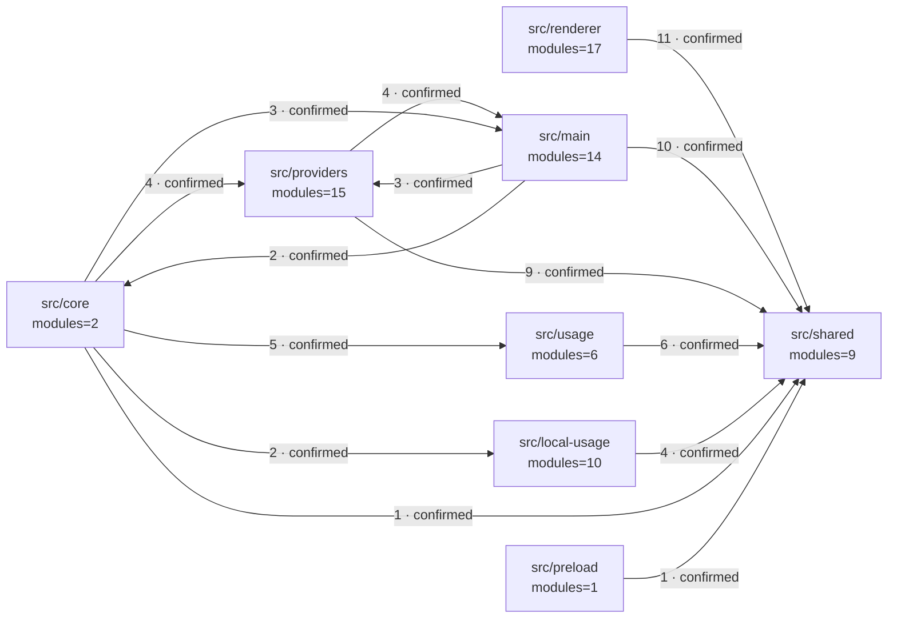
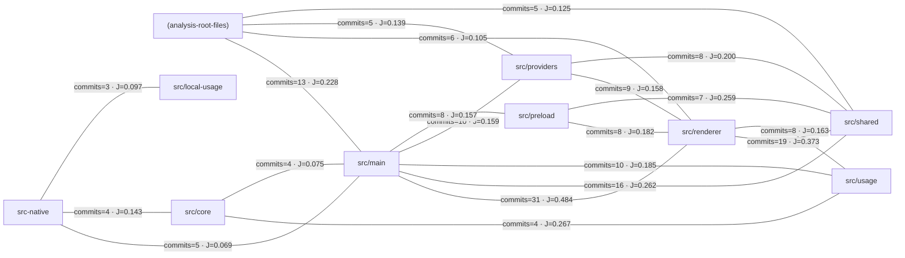

<!-- 이 파일은 render-architecture-evidence.py가 생성합니다. 직접 수정하지 마십시오. -->

# 기계 생성 아키텍처 증거

> 정적 분석 결과를 결정적으로 렌더링한 기계 증거다. 평가·권장안이 아니며 런타임 실행 빈도를 나타내지 않는다.

## 1. Snapshot과 capability

| 항목 | 값 |
| --- | --- |
| schema version | 1.0.0 |
| source digest | e0c0f331b8b5c083e6c0edde0f47bcbbdd0000371d1fcddff4bd57023f8030c1 |
| Git commit | 092f5a88d1e9a32449205e81d65b08b5293837d1 |
| dirty | false |
| 선택 scope | production |
| 분석 module | 117 |
| 제외 module | 46 |
| 추출 symbol | 933 |
| entrypoint 관측 | 85 |
| 정규화된 분석 entrypoint | 34 |
| 미포함 nested TypeScript project | 0 |
| 일차 경계 전략 | directory |

capability: architecture-static-summary, call-candidates, cargo-metadata, entrypoint-discovery, git-change-coupling, module-graph, module-scope-classification, source-inventory, symbol-index, typescript-compiler-api

## 2. Coverage와 edge 처리 단계

| 단계 | 결과 | 기계적 정의 |
| --- | --- | --- |
| 원시 edge 관측 | 13,492 | 정적 분석기가 기록한 전체 관계 관측 |
| 구조 의존 edge 관측 | 12,508 | 원시 관측 중 imports·calls·registers |
| package-root 내부 재분류 관측 | 0 | 구조 의존 관측 중 알려진 내부 module prefix와 일치한 부분집합 |
| 정규화된 module dependency | 281 | 내부 source·target 확인, self-edge 제외, source·target·type·resolution 중복 제거 |
| 경계 내부 module dependency | 216 | source와 target의 일차 경계가 같은 정규화 관계 |
| 경계 간 module dependency | 65 | source와 target의 일차 경계가 다른 정규화 관계 |
| 경계 쌍 집계 행 | 14 | source 경계·target 경계·confidence별 집계 행 |

`원시 관측 13,492 → 의존 유형 선별 12,508 → 내부 판정·self-edge 제외·중복 제거 → module dependency 281`

내부 재분류 관측은 구조 의존 관측의 부분집합이므로 별도 graph 크기로 더하거나 빼지 않는다.

| 관계 유형 | 원시 관측 | 정규화된 내부 module dependency |
| --- | --- | --- |
| calls | 11,900 | 122 |
| contains | 933 | 0 |
| exports | 51 | 0 |
| imports | 531 | 159 |
| registers | 77 | 0 |

## 3. 경계별 구조 집계

| 경계 | module | 내부 dependency | inbound | outbound |
| --- | --- | --- | --- | --- |
| src-native | 33 | 128 | 0 | 0 |
| src/renderer | 17 | 28 | 0 | 11 |
| src/providers | 15 | 19 | 7 | 13 |
| src/main | 14 | 20 | 7 | 15 |
| (analysis-root-files) | 10 | 0 | 0 | 0 |
| src/local-usage | 10 | 13 | 2 | 4 |
| src/shared | 9 | 6 | 42 | 0 |
| src/usage | 6 | 2 | 5 | 6 |
| src/core | 2 | 0 | 2 | 15 |
| src/preload | 1 | 0 | 0 | 1 |

### Module dependency hub

| module | import fan-in | import fan-out | 합계 |
| --- | --- | --- | --- |
| src/shared/index.ts | 35 | 0 | 35 |
| src/main/application.ts | 1 | 12 | 13 |
| src-native/ui/mod.rs | 1 | 10 | 11 |
| src/renderer/selectors.ts | 7 | 1 | 8 |
| src/main/platform/index.ts | 6 | 2 | 8 |
| src/renderer/components/ProviderCard.tsx | 1 | 6 | 7 |
| src/renderer/App.tsx | 0 | 7 | 7 |
| src-native/core/types.rs | 6 | 0 | 6 |
| src-native/ui/theme.rs | 6 | 0 | 6 |
| src/local-usage/types.ts | 5 | 1 | 6 |
| src/renderer/components/HelpTrigger.tsx | 5 | 1 | 6 |
| src/renderer/components/QuotaMeter.tsx | 2 | 4 | 6 |
| src-native/core/local_usage/mod.rs | 1 | 5 | 6 |
| src/renderer/components/CompactQuotaTable.tsx | 1 | 5 | 6 |
| src/core/UsageMonitorCore.ts | 0 | 6 | 6 |
| src/providers/claude/ptyProbe.ts | 3 | 2 | 5 |
| src-native/core/mod.rs | 1 | 4 | 5 |
| src/local-usage/claude/scanner.ts | 0 | 5 | 5 |
| src/local-usage/codex/scanner.ts | 0 | 5 | 5 |
| src/local-usage/checkpointStore.ts | 2 | 2 | 4 |
| src/providers/codex/appServerClient.ts | 2 | 2 | 4 |
| src-native/providers/mod.rs | 1 | 3 | 4 |
| src-native/shell/mod.rs | 1 | 3 | 4 |
| src/main/claudeSetup.ts | 1 | 3 | 4 |
| src/providers/claude/normalize.ts | 1 | 3 | 4 |

fan-in·fan-out은 정규화된 `imports` 관계만 센다.

## 4. 현재 경계 dependency

상위 14개 집계 행만 표시했다. 실선은 confirmed, 점선은 uncertain이며 수치는 정규화된 module dependency 수다.

| source 경계 | target 경계 | confidence | module dependency |
| --- | --- | --- | --- |
| src/renderer | src/shared | confirmed | 11 |
| src/main | src/shared | confirmed | 10 |
| src/providers | src/shared | confirmed | 9 |
| src/usage | src/shared | confirmed | 6 |
| src/core | src/usage | confirmed | 5 |
| src/core | src/providers | confirmed | 4 |
| src/local-usage | src/shared | confirmed | 4 |
| src/providers | src/main | confirmed | 4 |
| src/core | src/main | confirmed | 3 |
| src/main | src/providers | confirmed | 3 |
| src/core | src/local-usage | confirmed | 2 |
| src/main | src/core | confirmed | 2 |
| src/core | src/shared | confirmed | 1 |
| src/preload | src/shared | confirmed | 1 |

## 5. 강결합 순환군

| 순환군 | confidence | 경계 교차 | module 수 | 경계 | 대표 module |
| --- | --- | --- | --- | --- | --- |
| SCC-01 | candidate | 아니오 | 13 | src-native | src-native/core/engine.rs, src-native/core/vendor_health.rs, src-native/shell/desktop.rs, src-native/shell/mod.rs, src-native/ui/animated_text.rs |
| SCC-02 | candidate | 아니오 | 4 | src-native | src-native/providers/antigravity.rs, src-native/providers/claude.rs, src-native/providers/codex.rs, src-native/providers/mod.rs |
| SCC-03 | candidate | 아니오 | 3 | src-native | src-native/core/local_usage/claude.rs, src-native/core/local_usage/codex.rs, src-native/core/local_usage/mod.rs |

## 6. Entrypoint 정적 도달 범위

| entrypoint | 종류 | resolution | 도달 module | 도달 경계 | 계산 기준 |
| --- | --- | --- | --- | --- | --- |
| src/main/application.ts#startApplication | worker | candidate | 40 | 6 | module-dependency-closure |
| src/main/application.ts#startApplication.createMainWindow | worker | candidate | 40 | 6 | module-dependency-closure |
| src-native/bin/test_collector.rs#test-collector | cli | resolved | 30 | 1 | module-dependency-closure |
| src-native/lib.rs#llm_usage_monitor_core | library | resolved | 29 | 1 | module-dependency-closure |
| src/core/UsageMonitorCore.ts#UsageMonitorCore.initSubscriptions | worker | candidate | 26 | 6 | module-dependency-closure |
| src/core/UsageMonitorCore.ts#UsageMonitorCore.subscribe | worker | candidate | 26 | 6 | module-dependency-closure |
| src/core/UsageMonitorCore.ts#UsageMonitorCore.trackBackground | http | candidate | 26 | 6 | module-dependency-closure |
| src-native/bin/benchmark.rs#benchmark-native | cli | resolved | 19 | 1 | module-dependency-closure |
| src-native/bin/cache_fixture.rs#cache-fixture | cli | resolved | 19 | 1 | module-dependency-closure |
| src-native/bin/main.rs#llm-usage-monitor | cli | resolved | 19 | 1 | module-dependency-closure |
| src-native/bin/main.rs#main | cli | resolved | 19 | 1 | module-dependency-closure |
| src/providers/antigravity/provider.ts#AntigravityQuotaProvider.fetchQuota | http | candidate | 8 | 3 | module-dependency-closure |
| src/providers/codex/appServerClient.ts#CodexAppServerClient.close.finish | http | candidate | 7 | 3 | module-dependency-closure |
| src/providers/codex/appServerClient.ts#CodexAppServerClient.receiveLine | http | candidate | 7 | 3 | module-dependency-closure |
| src/providers/codex/appServerClient.ts#CodexAppServerClient.request | http | candidate | 7 | 3 | module-dependency-closure |
| src/providers/codex/appServerClient.ts#createNodeTransport.onStdout | worker | candidate | 7 | 3 | module-dependency-closure |
| src/local-usage/claude/scanner.ts#ClaudeLocalUsageScanner.watch | worker | candidate | 6 | 2 | module-dependency-closure |
| src/local-usage/codex/scanner.ts#CodexLocalUsageScanner.watch | worker | candidate | 6 | 2 | module-dependency-closure |
| src/providers/antigravity/processRunner.ts#AntigravityCliRunner.runCommand | worker | candidate | 6 | 3 | module-dependency-closure |
| src/renderer/hooks/useUsageMonitor.ts#useUsageMonitor | worker | candidate | 5 | 2 | module-dependency-closure |
| src/usage/localUsageCoordinator.ts#createLocalUsageCoordinator.dirty | http | candidate | 3 | 2 | module-dependency-closure |
| src/usage/localUsageCoordinator.ts#createLocalUsageCoordinator.request | http | candidate | 3 | 2 | module-dependency-closure |
| src/usage/vendorHealthPoller.ts#createVendorHealthPoller.request | http | candidate | 3 | 2 | module-dependency-closure |
| src/main/fakeUsage.ts#createFakeUsageStore.subscribe | http | candidate | 2 | 2 | module-dependency-closure |
| src/preload/index.ts#subscribe | worker | candidate | 2 | 2 | module-dependency-closure |
| src/usage/poller.ts#createUsagePoller.clearTimer | http | candidate | 2 | 2 | module-dependency-closure |
| src/usage/poller.ts#createUsagePoller.refreshProvider | http | candidate | 2 | 2 | module-dependency-closure |
| src/usage/poller.ts#createUsagePoller.scheduleNext | http | candidate | 2 | 2 | module-dependency-closure |
| src/usage/store.ts#createUsageStore.setTaskRefreshing | http | candidate | 2 | 2 | module-dependency-closure |
| src/usage/store.ts#createUsageStore.startRefresh | http | candidate | 2 | 2 | module-dependency-closure |
| src/usage/store.ts#createUsageStore.subscribe | http | candidate | 2 | 2 | module-dependency-closure |
| src/main/runtime.ts#registerRendererDiagnostics | worker | candidate | 1 | 1 | module-dependency-closure |
| src/main/runtime.ts#registerRuntimeDiagnostics | worker | candidate | 1 | 1 | module-dependency-closure |
| src/providers/claude/usageParser.ts#parseClaudeUsageScreen | http | candidate | 1 | 1 | module-dependency-closure |

이 수치는 module dependency closure이며 실제 요청 trace가 아니다.

## 7. Git change coupling

| 항목 | 값 |
| --- | --- |
| 상태 | available |
| 사유 | 해당 없음 |
| 분석 commit | 106 |
| 제외 bulk commit | 0 |
| shallow | false |

상위 20개 경계 쌍만 표시했다. 이 관계는 설계 위반의 증명이 아니라 추가 조사 신호다.

## 8. 우선 read set

| path | symbol·line | 선정 이유 |
| --- | --- | --- |
| src-native/bin/test_collector.rs |  | entrypoint:cli:src-native |
| src-native/core/local_usage/claude.rs |  | dependency-cycle |
| src-native/core/local_usage/mod.rs |  | dependency-cycle,dependency-hub |
| src-native/core/types.rs |  | dependency-hub |
| src-native/lib.rs |  | entrypoint:library:src-native |
| src-native/providers/antigravity.rs |  | dependency-cycle |
| src-native/providers/mod.rs |  | dependency-cycle |
| src-native/shell/mod.rs |  | dependency-cycle |
| src-native/ui/mod.rs |  | dependency-cycle,dependency-hub |
| src-native/ui/theme.rs |  | dependency-hub |
| src/core/UsageMonitorCore.ts | UsageMonitorCore.trackBackground:226-233 | dependency-hub,entrypoint:http:src/core,entrypoint:worker:src/core |
| src/local-usage/claude/scanner.ts | ClaudeLocalUsageScanner.watch:305-316 | entrypoint:worker:src/local-usage |
| src/local-usage/types.ts |  | dependency-hub |
| src/main/application.ts | startApplication:131-515 | dependency-hub,entrypoint:worker:src/main |
| src/main/fakeUsage.ts | createFakeUsageStore.subscribe:327-330 | entrypoint:http:src/main |
| src/main/platform/index.ts |  | dependency-hub |
| src/preload/index.ts | subscribe:37-48 | entrypoint:worker:src/preload |
| src/providers/antigravity/provider.ts | AntigravityQuotaProvider.fetchQuota:91-127 | entrypoint:http:src/providers |
| src/providers/codex/appServerClient.ts | createNodeTransport.onStdout:95-97 | entrypoint:worker:src/providers |
| src/renderer/App.tsx |  | dependency-hub |
| src/renderer/components/CompactQuotaTable.tsx |  | dependency-hub |
| src/renderer/components/HelpTrigger.tsx |  | dependency-hub |
| src/renderer/components/ProviderCard.tsx |  | dependency-hub |
| src/renderer/components/QuotaMeter.tsx |  | dependency-hub |
| src/renderer/hooks/useUsageMonitor.ts | useUsageMonitor:11-260 | entrypoint:worker:src/renderer |
| src/renderer/selectors.ts |  | dependency-hub |
| src/shared/index.ts |  | dependency-hub |
| src/usage/localUsageCoordinator.ts | createLocalUsageCoordinator.dirty:93-104 | entrypoint:http:src/usage |

## 9. Capability 제한과 diagnostics

| 수준 | 코드 | 메시지 |
| --- | --- | --- |
| error | source-rust-std-source-unavailable | rust-src를 찾지 못해 rust-analyzer sysroot 로딩을 시작하지 않았습니다. |
| info | non-production-excluded | 기본 구조 집계에서 test·fixture·example module 46개를 제외했습니다. |

## 해석 원칙

- 정적 dependency, 순환, fan-in/out과 change coupling은 조사 우선순위이며 설계 위반의 단독 증거가 아니다.
- Context, Container, 데이터 소유권, 품질 목표와 목표 아키텍처는 이 문서가 생성하지 않는다.
- 평가는 동일 source digest의 인간 검토 문서에서 이 문서의 anchor를 참조해 작성한다.
